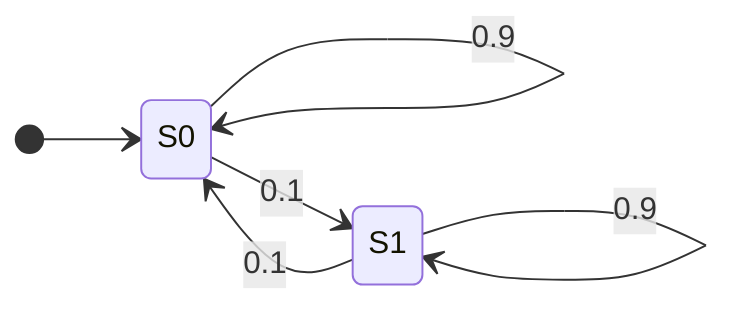

# Entropy Rates and the AEP

Information per symbol for a process with memory, and the asymptotic equipartition property that makes long sequences predictable in bulk.

## Entropy Rate of a Stationary Process

<!-- section: definition-entropy-rate -->

:::definition[Entropy rate]{#entropy-rate}
For a discrete-time stochastic process $\{X_i\}$ define, when the limits exist,

$$H(\mathcal X) = \lim_{n\to\infty}\frac1n H(X_1,\dots,X_n), \qquad H'(\mathcal X) = \lim_{n\to\infty} H\bigl(X_n \mid X_1,\dots,X_{n-1}\bigr).$$

The first is the **per-symbol block rate**, the second the **conditional rate**.
:::

:::definition[Stationary process]{#stationary}
A process is **stationary** if its finite-dimensional distributions are shift-invariant: for every $n$ and every $k \ge 1$,

$$P(X_1 = x_1,\dots,X_n = x_n) = P(X_{1+k}=x_1,\dots,X_{n+k}=x_n).$$
:::

The two rates look different — one averages a whole block, the other looks one symbol ahead — but for a stationary process they exist and coincide. The proof is a good illustration of how the chain rule and "conditioning reduces entropy" combine.

:::lemma[The conditional entropies decrease]{#conditional-decreasing}
For a stationary process, $H(X_n\mid X_1,\dots,X_{n-1})$ is non-increasing in $n$ and therefore converges (it is bounded below by $0$).
:::

:::proof
Conditioning on more reduces entropy, so

$$H(X_n \mid X_1,\dots,X_{n-1}) \le H(X_n\mid X_2,\dots,X_{n-1}),$$

since the left side conditions on one extra variable. Stationarity says the right side equals $H(X_{n-1}\mid X_1,\dots,X_{n-2})$, because the block $(X_2,\dots,X_n)$ has the same joint law as $(X_1,\dots,X_{n-1})$. Hence the sequence is non-increasing, and being non-negative it converges.
:::

:::lemma[Cesàro mean]{#cesaro}
If $a_n \to a$ then $\frac1n\sum_{i=1}^n a_i \to a$.
:::

:::proof
Given $\varepsilon>0$ choose $N$ with $|a_i - a| < \varepsilon/2$ for $i > N$. For $n > N$,

$$\Bigl|\frac1n\sum_{i=1}^n a_i - a\Bigr| \le \frac1n\sum_{i=1}^{N}|a_i-a| + \frac1n\sum_{i=N+1}^{n}|a_i-a| < \frac{C_N}{n} + \frac{\varepsilon}{2},$$

where $C_N = \sum_{i\le N}|a_i - a|$ is a fixed number. Taking $n > 2C_N/\varepsilon$ makes the whole expression less than $\varepsilon$.
:::

:::theorem[The two rates agree]{#rates-agree}
For a stationary process both limits in Definition *Entropy rate* exist and

$$H(\mathcal X) = H'(\mathcal X).$$
:::

:::proof
The conditional rate $H'$ exists by Lemma *The conditional entropies decrease*. The chain rule writes the block entropy as a sum of exactly those conditional entropies:

$$\frac1n H(X_1,\dots,X_n) = \frac1n\sum_{i=1}^n H\bigl(X_i \mid X_1,\dots,X_{i-1}\bigr).$$

The right side is the Cesàro mean of a convergent sequence, so by Lemma *Cesàro mean* it converges to the same limit $H'(\mathcal X)$. Hence $H(\mathcal X)$ exists and equals $H'(\mathcal X)$.
:::

:::figure[For a stationary process the one-step conditional entropies $H(X_n\mid X_1,\dots,X_{n-1})$ fall monotonically to the entropy rate, while the block averages $\tfrac1n H(X_1,\dots,X_n)$ — their Cesàro means — approach the same limit from above and more slowly. Here the limit is $0.8$ bits per symbol.]{#entropy-rate-figure}
{
  "type": "plot",
  "x": [0.5, 9.0],
  "y": [0.7, 1.35],
  "xTicks": 1,
  "yTicks": 0.1,
  "xLabel": "n",
  "yLabel": "bits per symbol",
  "marks": [
    { "kind": "path", "points": [[1, 1.2], [2, 1.1], [3, 1.0333], [4, 0.9875], [5, 0.955], [6, 0.9313], [7, 0.9134], [8, 0.8996]], "tone": "alt", "dashed": true },
    { "kind": "path", "points": [[1, 1.2], [2, 1.0], [3, 0.9], [4, 0.85], [5, 0.825], [6, 0.8125], [7, 0.80625], [8, 0.803125]], "tone": "result" },
    { "kind": "line", "through": [[0.5, 0.8], [9.0, 0.8]], "tone": "muted", "dashed": true },
    { "kind": "text", "at": [6.3, 1.22], "text": "block average (1/n)H(X1..Xn)", "leaderTo": [6.0, 0.9313] },
    { "kind": "text", "at": [5.9, 0.75], "text": "H(Xn | past)", "leaderTo": [5.0, 0.825] },
    { "kind": "text", "at": [2.0, 0.83], "text": "entropy rate h = 0.8", "leaderTo": [3.0, 0.8] }
  ]
}
:::

:::corollary[The rate is below the marginal entropy]{#rate-below-marginal}
For a stationary process, $H(\mathcal X) \le H(X_1)$, with equality if and only if the process is i.i.d.
:::

:::proof
Each term $H(X_i\mid X_{<i}) \le H(X_i) = H(X_1)$ by conditioning-reduces-entropy and stationarity; averaging preserves the bound. Equality for every $i$ requires $X_i$ independent of its past for every $i$, which with stationarity is exactly independence with a common marginal.
:::

:::intuition
Memory is redundancy, and redundancy is compressibility. Written English has a per-letter marginal entropy of about $4.1$ bits, but its entropy rate — measured by how well people predict the next letter given the text so far — is closer to $1.3$ bits. The three-bit gap is grammar, spelling and meaning, and it is exactly what a good compressor harvests.
:::

:::example[A memoryless source]
An i.i.d. source has per-symbol entropy $2$ bits. Find its entropy rate.
:::

:::solution
Independence makes the chain rule collapse: $H(X_i\mid X_{<i}) = H(X_i) = 2$ for every $i$, so $H(X_1,\dots,X_n) = 2n$ and

$$\frac1n H(X_1,\dots,X_n) = 2 \quad\text{for every } n,$$

giving $H(\mathcal X)=2$ bits/symbol. Note that the rate is attained at *every* block length, not merely in the limit — for an i.i.d. source there is nothing to be gained by coding long blocks other than amortising the $+1$ of the source coding theorem. □
:::

## Entropy Rate of a Markov Chain

<!-- section: properties-processes -->

The most important computable case is a Markov chain, where the entire past is summarised by the current state.

:::definition[Stationary Markov chain]{#markov-chain}
A process is a **Markov chain** if $p(x_{n+1}\mid x_1,\dots,x_n) = p(x_{n+1}\mid x_n)$ for all $n$. It is **time-invariant** if that transition law $P_{ij} = P(X_{n+1}=j \mid X_n = i)$ does not depend on $n$, and **stationary** if in addition the marginal law $\mu$ satisfies $\mu_j = \sum_i \mu_i P_{ij}$ for all $j$.
:::

:::theorem[Entropy rate of a Markov chain]{#markov-entropy-rate}
For a stationary Markov chain with stationary distribution $\mu$ and transition matrix $P$,

$$H(\mathcal X) = H(X_2 \mid X_1) = -\sum_{i,j} \mu_i P_{ij}\log_2 P_{ij}.$$

For a stationary Markov chain of order $k$, $H(\mathcal X) = H(X_{k+1}\mid X_1,\dots,X_k)$.
:::

:::proof
By Theorem *The two rates agree*, $H(\mathcal X) = \lim_n H(X_n\mid X_1,\dots,X_{n-1})$. The Markov property makes the conditioning collapse: given $X_{n-1}$, the variable $X_n$ is independent of $X_1,\dots,X_{n-2}$, so $H(X_n\mid X_1,\dots,X_{n-1}) = H(X_n\mid X_{n-1})$, and stationarity makes this the same number for every $n$, namely $H(X_2|X_1)$. The sequence is constant, so its limit is that constant. Expanding the definition of conditional entropy with $p(i,j) = \mu_i P_{ij}$ gives the displayed formula. The order-$k$ case is identical with the state taken to be the last $k$ symbols.
:::

:::example[A sticky binary chain]
A binary chain stays in its current state with probability $0.9$ and flips with probability $0.1$. Find the stationary distribution, the marginal entropy, and the entropy rate.
:::

:::solution
Symmetry gives $\mu = (\tfrac12,\tfrac12)$, which we check: $\tfrac12(0.9)+\tfrac12(0.1)=\tfrac12$. ✓ So the marginal entropy is $H(X_1)=1$ bit.

From either state the next symbol is a Bernoulli$(0.1)$ decision to flip, so $H(X_2\mid X_1 = i) = h(0.1) \approx 0.469$ for each $i$, and

$$H(\mathcal X) = \tfrac12(0.469)+\tfrac12(0.469) = 0.469 \text{ bits/symbol}.$$

Sanity check: $0.469 < 1 = H(X_1)$, as Corollary *The rate is below the marginal entropy* requires, and the gap of $0.531$ bits per symbol is precisely $I(X_1;X_2)$ — the predictability that memory supplies. A file of a million such symbols compresses to about $469$ kbit, not $1$ Mbit. □
:::

:::example[An asymmetric two-state chain]
A chain has $P_{01}=0.2$, $P_{10}=0.4$. Find $\mu$ and the entropy rate.
:::

:::solution
Stationarity requires $\mu_0 P_{01} = \mu_1 P_{10}$ (balance of flow across the cut), so $0.2\mu_0 = 0.4\mu_1$, giving $\mu_0 = 2\mu_1$ and hence $\mu = (\tfrac23,\tfrac13)$.

From state $0$ the next symbol is Bernoulli$(0.2)$, contributing $h(0.2) \approx 0.7219$; from state $1$ it is Bernoulli$(0.4)$, contributing $h(0.4)\approx 0.9710$. Weighting,

$$H(\mathcal X) = \tfrac23(0.7219)+\tfrac13(0.9710) \approx 0.4813+0.3237 = 0.805 \text{ bits/symbol}.$$

Sanity check: the marginal entropy is $h(1/3)\approx 0.918$ bits, and indeed $0.805 < 0.918$. □
:::

:::pitfall
The entropy rate is **not** the entropy of the stationary distribution. $H(\mu)$ ignores the transition structure entirely and is only an upper bound. In the sticky chain above, $H(\mu)=1$ while the rate is $0.469$ — a factor of two.
:::

:::remark
A *hidden* Markov process — a function of a Markov chain, observed through noise — need not be Markov of any finite order, and its entropy rate has no closed form. It can be sandwiched: $H(X_n \mid X_{1:n-1}, S_1) \le H(\mathcal X) \le H(X_n\mid X_{1:n-1})$, where $S_1$ is the initial hidden state, and both bounds converge to the rate. Establishing that sandwich is beyond this chapter.
:::

## The AEP, Compression, and the Continuous Analogue

<!-- section: asymptotic -->

The entropy rate is not only an average; for well-behaved processes it is the value that essentially *every* long realisation exhibits. That is the content of the asymptotic equipartition property.

:::definition[Typical set]{#typical-set}
For $\varepsilon>0$, the **typical set** $A_\varepsilon^{(n)} \subseteq \mathcal X^n$ consists of the sequences $(x_1,\dots,x_n)$ with

$$2^{-n(H+\varepsilon)} \le p(x_1,\dots,x_n) \le 2^{-n(H-\varepsilon)},$$

equivalently those whose per-symbol code length $-\tfrac1n\log_2 p(x_1,\dots,x_n)$ lies within $\varepsilon$ of $H$.
:::

:::theorem[Asymptotic equipartition property, i.i.d. case]{#aep}
Let $X_1,X_2,\dots$ be i.i.d. with entropy $H = H(X)$ on a finite alphabet. Then

$$-\frac1n\log_2 p(X_1,\dots,X_n) \longrightarrow H \quad\text{in probability},$$

and consequently, for every $\varepsilon>0$ and all large $n$,

$$P\bigl(A_\varepsilon^{(n)}\bigr) > 1-\varepsilon, \qquad (1-\varepsilon)2^{n(H-\varepsilon)} \le \bigl|A_\varepsilon^{(n)}\bigr| \le 2^{n(H+\varepsilon)}.$$
:::

:::proof
Independence factors the joint mass function, so

$$-\frac1n\log_2 p(X_1,\dots,X_n) = \frac1n\sum_{i=1}^n \bigl(-\log_2 p(X_i)\bigr),$$

an average of i.i.d. random variables with common mean $\mathbb{E}[-\log_2 p(X)] = H(X)$ and finite variance (the alphabet is finite). The weak law of large numbers gives convergence in probability to $H$, which is the first claim, and it is exactly the statement that $P(A_\varepsilon^{(n)}) \to 1$.

For the size bounds, every sequence in $A_\varepsilon^{(n)}$ has probability at least $2^{-n(H+\varepsilon)}$, and the total probability of the set is at most $1$, so $|A_\varepsilon^{(n)}| \le 2^{n(H+\varepsilon)}$. For the lower bound, each sequence has probability at most $2^{-n(H-\varepsilon)}$ and the set carries probability more than $1-\varepsilon$ for large $n$, so $|A_\varepsilon^{(n)}| \ge (1-\varepsilon)2^{n(H-\varepsilon)}$.
:::

:::intuition
Of the $|\mathcal X|^n$ possible sequences, only about $2^{nH}$ are ever seen, and they are all roughly equally likely. Compression is therefore just indexing: number the typical sequences and send the index, which needs $nH$ bits. Everything else is handled by an escape code whose cost vanishes because its probability does.
:::

:::theorem[Shannon's source coding theorem, block form]{#block-source-coding}
For a stationary ergodic process with entropy rate $H(\mathcal X)$ and any $R > H(\mathcal X)$, there are codes mapping blocks of length $n$ into $nR$ bits with error probability tending to $0$; for $R < H(\mathcal X)$ the error probability tends to $1$.
:::

:::proof
*Sketch, i.i.d. case.* Achievability: index the typical set, which has at most $2^{n(H+\varepsilon)}$ members, using $n(H+\varepsilon)+1$ bits, and flag atypical sequences with a one-bit escape followed by a raw description. The error probability is $P(A_\varepsilon^{(n)c}) \to 0$, and the rate is $H+\varepsilon$, which is below $R$ for small $\varepsilon$. Converse: a set of at most $2^{nR}$ sequences with $R < H - 2\varepsilon$ can cover at most $2^{nR}2^{-n(H-\varepsilon)} \to 0$ of the typical probability, plus the vanishing atypical part. The general stationary ergodic case replaces the weak law with the Shannon–McMillan–Breiman theorem, whose proof is out of scope.
:::

:::example[Sizing a file from its rate]
A source with entropy rate $1.2$ bits/symbol emits $1{,}000{,}000$ symbols. How large is the compressed file, and what would using the marginal entropy of $1.8$ bits/symbol have predicted?
:::

:::solution
The block entropy is about $nH(\mathcal X) = 1.2\times10^{6}$ bits $=150{,}000$ bytes $=150$ kB, and Theorem *Shannon's source coding theorem, block form* says no scheme does sustainably better.

Using the marginal entropy instead would predict $1.8\times 10^6$ bits $=225$ kB. That estimate is an upper bound, not the truth: it ignores the memory, and the $75$ kB difference is exactly the redundancy a model of the dependence recovers. □
:::

Everything in this chapter has assumed a discrete alphabet. The continuous analogue is genuinely different, and the differences are worth stating because they are a standard source of error.

:::definition[Differential entropy]{#differential-entropy}
For a random variable $X$ with density $f$ on $\mathbb{R}$,

$$h(X) = -\int_{S} f(x)\log_2 f(x)\,dx,$$

where $S$ is the support of $f$, whenever the integral exists. (The lower-case $h$ here is the traditional notation and unfortunately collides with the binary entropy function $h(p)$; the argument tells them apart — a random variable means differential entropy, a number in $[0,1]$ means the binary entropy.)
:::

:::theorem[Differential entropy of a uniform and a Gaussian]{#differential-examples}
If $X$ is uniform on $[0,a]$ then $h(X) = \log_2 a$. If $X$ is Gaussian with variance $\sigma^2$ then $h(X) = \tfrac12\log_2\bigl(2\pi e\sigma^2\bigr)$.
:::

:::proof
Uniform: $f = 1/a$ on $[0,a]$, so $h = -\int_0^a \tfrac1a\log_2\tfrac1a\,dx = \log_2 a$.

Gaussian: with $f(x) = (2\pi\sigma^2)^{-1/2}e^{-x^2/2\sigma^2}$,

$$-\ln f(X) = \tfrac12\ln(2\pi\sigma^2) + \frac{X^2}{2\sigma^2},$$

whose expectation is $\tfrac12\ln(2\pi\sigma^2) + \tfrac12 = \tfrac12\ln(2\pi e\sigma^2)$. Dividing by $\ln 2$ converts nats to bits.
:::

:::pitfall
Differential entropy is **not** a limit of discrete entropies and it does not inherit their properties.

- It can be **negative**: the uniform on $[0,\tfrac12]$ has $h = \log_2\tfrac12 = -1$ bit.
- It is **not invariant under relabelling**: $h(aX) = h(X)+\log_2|a|$, whereas discrete entropy is unchanged by any injective map. Differential entropy therefore depends on the units in which $X$ is measured.
- It is **not** the number of bits needed to describe $X$; describing a real number exactly takes infinitely many bits. The correct statement is that an $n$-bit uniform quantisation of $X$ has discrete entropy approximately $h(X)+n$.
:::

:::remark
What survives the passage to densities is precisely the *relative* quantities. Relative entropy $D(f\|g) = \int f\log_2(f/g)$ is still non-negative, still infinite on support mismatch, and still invariant under a change of variables, because the Jacobian cancels between numerator and denominator. Mutual information $I(X;Y) = D\bigl(f_{XY}\|f_Xf_Y\bigr)$ inherits all of this: it is non-negative, invariant under smooth invertible relabelling of either variable, and satisfies the data processing inequality unchanged. This is the deeper reason to regard $D$, rather than $H$, as the fundamental object: $H$ is the special case $\log_2|\mathcal X| - D(p\|u)$ that only exists when a canonical uniform reference measure does.
:::

:::summary
For a stationary process the entropy rate exists, equals the limiting one-step conditional entropy, is at most the marginal entropy with equality only in the i.i.d. case, equals $-\sum_{i,j}\mu_iP_{ij}\log_2 P_{ij}$ for a stationary Markov chain, and — by the AEP — is both the exponent of the typical set and the exact asymptotic cost of lossless compression.
:::

## The Law of Large Numbers for Information {#definition}

<!-- section: definition -->

Entropy was introduced as the expected surprise of a single draw. To say anything about *files* we need a per-symbol quantity that survives dependence between symbols.

:::definition[Entropy rate]{#entropy-rate}
The **entropy rate** of a stochastic process $\{X_i\}$ is

$$h = \lim_{n\to\infty} \frac{1}{n} H(X_1,\dots,X_n),$$

whenever the limit exists. For a stationary process the limit always exists and also equals $\lim_{n\to\infty} H(X_n \mid X_1,\dots,X_{n-1})$, the conditional entropy of the next symbol given the entire past.
:::

For an i.i.d. source the chain rule gives $H(X_1,\dots,X_n) = nH(X)$ immediately, so $h = H(X)$: the entropy rate is the ordinary single-symbol entropy. For a source with memory the two differ, and the difference is exactly the redundancy that a model of the memory can harvest.

:::definition[Sample information rate]{#sample-information-rate}
For a string $x^n$ of positive probability, the **sample information rate** is

$$-\frac{1}{n}\log p(x^n),$$

the number of bits per symbol an ideal code would spend on this particular string. The random variable $-\frac1n \log p(X^n)$ is the empirical rate of the string actually produced.
:::

The entropy rate is an expectation, $h = \lim \frac1n E[-\log p(X^n)]$; the sample information rate is the random quantity being averaged. The AEP says that the random quantity concentrates on its mean — that essentially every long string costs the same number of bits per symbol.

:::theorem[Weak law of large numbers]{#wlln}
If $Y_1, Y_2,\dots$ are i.i.d. with finite mean $\mu$, then $\frac1n\sum_{i=1}^n Y_i \to \mu$ in probability: for every $\varepsilon > 0$,

$$\Pr\!\left( \left| \frac1n\sum_{i=1}^n Y_i - \mu \right| \ge \varepsilon \right) \longrightarrow 0 \qquad (n\to\infty).$$
:::

:::proof
We prove the case of finite variance $\sigma^2$, which is all we need here: a finite alphabet makes $-\log p(X)$ a bounded random variable. The sample mean $\bar Y_n$ has mean $\mu$ and, by independence, variance $\sigma^2/n$, so Chebyshev's inequality gives

$$\Pr\!\left( |\bar Y_n - \mu| \ge \varepsilon \right) \le \frac{\sigma^2}{n\varepsilon^2} \longrightarrow 0 .$$

(The general finite-mean case is Khinchin's theorem and requires a truncation argument, which we do not need.)
:::

:::theorem[Asymptotic equipartition property, i.i.d. case]{#aep}
Let $X_1,X_2,\dots$ be i.i.d. with probability mass function $p$ on a finite alphabet, and write $H = H(X)$. Then

$$-\frac{1}{n}\log p(X_1,\dots,X_n) \longrightarrow H \quad \text{in probability.}$$
:::

:::proof
Independence factorises the joint mass function, $p(X^n) = \prod_{i=1}^n p(X_i)$, and the logarithm turns the product into a sum:

$$-\frac1n \log p(X^n) = \frac1n \sum_{i=1}^n \bigl(-\log p(X_i)\bigr).$$

The summands $Y_i = -\log p(X_i)$ are i.i.d. functions of i.i.d. variables, and are bounded because the alphabet is finite and every symbol that can actually be observed has $p(x)>0$. Their common mean is

$$E[Y_1] = \sum_{x} p(x)\bigl(-\log p(x)\bigr) = H(X).$$

The weak law of large numbers applied to $Y_1,Y_2,\dots$ now gives $\frac1n\sum_i Y_i \to H(X)$ in probability, which is the claim.
:::

That proof is worth rereading, because it is the whole trick: **the AEP is the weak law of large numbers applied to the random variable "surprise".** Everything in the first half of this chapter is a consequence of it.

:::remark[Beyond independence]
For a general stationary ergodic process the same conclusion holds, in the stronger almost-sure form

$$-\frac1n\log p(X^n) \longrightarrow h \quad \text{almost surely.}$$

This is the **Shannon–McMillan–Breiman theorem**. Its proof is genuinely harder — it rests on the Birkhoff ergodic theorem together with a martingale-convergence argument for the conditional densities — and is beyond the scope of this chapter. We use it only to state results in their natural generality; every proof given here is carried out in the i.i.d. case, where the weak law suffices.
:::

:::intuition
Toss a biased coin a million times. You cannot predict the sequence, but you *can* predict its cost: almost every outcome you will ever see takes about the same number of bits to write down, namely $h$ per toss.

Strings that are much cheaper (all heads) or much more expensive exist, but their total probability is negligible. Compression is the art of budgeting for the ordinary strings and merely coping with the rest.
:::

:::example[Sample rate of a specific string]
A memoryless binary source has $p(1) = 0.8$ and $p(0) = 0.2$. Compute $H(X)$ and the sample information rate of the particular string $x^{10} = 1111011110$.
:::

:::solution
The entropy is

$$H = -0.8\log 0.8 - 0.2\log 0.2 = 0.8(0.3219) + 0.2(2.3219) = 0.7219 \text{ bits/symbol.}$$

The string has eight 1s and two 0s, so

$$p(x^{10}) = 0.8^{8}\,0.2^{2} = (0.16777)(0.04) = 6.711\times10^{-3},$$

and its sample information rate is

$$-\frac{1}{10}\log_2\bigl(6.711\times10^{-3}\bigr) = \frac{7.219}{10} = 0.7219 \text{ bits/symbol.}$$

**Sanity check:** the string has exactly the expected composition (80% ones), so its rate lands exactly on $H$. A string with five 1s and five 0s would give $-\frac1{10}\log(0.8^5 0.2^5) = 1.1610$ bits/symbol, far above $H$ — atypical, and correspondingly improbable.
:::

:::pitfall[The AEP is not "all sequences are equally likely"]
The AEP says that the *logarithm* of the probability, divided by $n$, concentrates. It does not say probabilities are equal: two typical strings of length $1000$ may have probabilities differing by a factor of $2^{20}$ and still both be typical, because $20/1000$ is small. "Equipartition" is a statement about bits per symbol, not about total probability.
:::

## The Typical Set and How Big It Is {#typical-set}

<!-- section: typical-set -->

The AEP is a statement about a limit in probability. To use it we convert it into a statement about a *set* — the strings whose rate is close to $h$.

:::definition[Typical set]{#typical-set-def}
For $\varepsilon > 0$ and $n \ge 1$, the **typical set** $A_\varepsilon^{(n)} \subseteq \mathcal{X}^n$ consists of the strings whose sample information rate is within $\varepsilon$ of the entropy:

$$A_\varepsilon^{(n)} = \Bigl\{ x^n \in \mathcal{X}^n : \bigl| -\tfrac1n \log p(x^n) - H \bigr| \le \varepsilon \Bigr\},$$

equivalently the strings with

$$2^{-n(H+\varepsilon)} \;\le\; p(x^n) \;\le\; 2^{-n(H-\varepsilon)} .$$
:::

The two displays say the same thing; the second is the form used in every proof, so it is worth memorising. Typicality is defined *relative to a source*: a string is not typical or atypical in itself, only with respect to a distribution.

:::theorem[Properties of the typical set]{#typical-set-properties}
Let $X_1,\dots,X_n$ be i.i.d. $\sim p$ with entropy $H$. For every $\varepsilon>0$:

1. **Probability.** $\Pr\bigl(X^n \in A_\varepsilon^{(n)}\bigr) > 1-\varepsilon$ for all sufficiently large $n$.
2. **Upper bound on size.** $\bigl|A_\varepsilon^{(n)}\bigr| \le 2^{n(H+\varepsilon)}$ for every $n$.
3. **Lower bound on size.** $\bigl|A_\varepsilon^{(n)}\bigr| \ge (1-\varepsilon)\,2^{n(H-\varepsilon)}$ for all sufficiently large $n$.
:::

:::proof
**(1)** is a restatement of the AEP: convergence in probability of $-\frac1n\log p(X^n)$ to $H$ means precisely that the probability of the event $\bigl|-\frac1n\log p(X^n) - H\bigr| \le \varepsilon$ exceeds $1-\varepsilon$ once $n$ is large enough.

**(2)** Every typical string has probability at least $2^{-n(H+\varepsilon)}$, and probabilities of disjoint outcomes cannot sum past one:

$$1 \;\ge\; \sum_{x^n \in A_\varepsilon^{(n)}} p(x^n) \;\ge\; \sum_{x^n \in A_\varepsilon^{(n)}} 2^{-n(H+\varepsilon)} \;=\; \bigl|A_\varepsilon^{(n)}\bigr|\,2^{-n(H+\varepsilon)} .$$

Rearranging gives the bound, and note that it holds for *every* $n$, not only for large $n$.

**(3)** Run the same computation from the other side. For $n$ large enough that (1) holds,

$$1-\varepsilon \;<\; \Pr\bigl(A_\varepsilon^{(n)}\bigr) \;=\; \sum_{x^n \in A_\varepsilon^{(n)}} p(x^n) \;\le\; \bigl|A_\varepsilon^{(n)}\bigr|\, 2^{-n(H-\varepsilon)},$$

using the upper bound $p(x^n) \le 2^{-n(H-\varepsilon)}$ valid on the typical set. Rearranging gives (3).
:::

Clauses (2) and (3) pin the size of the typical set between $(1-\varepsilon)2^{n(H-\varepsilon)}$ and $2^{n(H+\varepsilon)}$: to first order in the exponent, $|A_\varepsilon^{(n)}| \approx 2^{nH}$. The whole space has $|\mathcal{X}|^n = 2^{n\log|\mathcal{X}|}$ strings, and $H \le \log|\mathcal{X}|$ with equality only for the uniform distribution. So unless the source is uniform, the typical set is an *exponentially vanishing fraction* of the space that nevertheless captures all but $\varepsilon$ of the probability.

:::intuition
Picture the space of all length-$n$ strings as a vast warehouse. The typical set is one small room inside it. Almost every string the source ever emits is found in that room, and the room holds about $2^{nH}$ objects, so a shelf label of $nH$ bits is enough to name any of them.

The rest of the warehouse is enormous but effectively empty: you may ignore it at the cost of an error probability $\varepsilon$ you choose in advance.
:::

:::example[The typical set of a biased coin]
For the source $p(1)=0.9$, $p(0)=0.1$ with $n=100$ and $\varepsilon=0.05$, estimate the size of the typical set and its share of the $2^{100}$ binary strings.
:::

:::solution
The entropy is

$$H = -0.9\log 0.9 - 0.1\log 0.1 = 0.9(0.152) + 0.1(3.322) = 0.469 \text{ bits/symbol.}$$

By clauses (2) and (3), the size lies between roughly $2^{100(0.469-0.05)} = 2^{41.9}$ and $2^{100(0.469+0.05)} = 2^{51.9}$; the natural estimate is $2^{nH} = 2^{46.9} \approx 1.3\times10^{14}$.

The fraction of the space is therefore about

$$\frac{2^{46.9}}{2^{100}} = 2^{-53.1} \approx 1.1\times 10^{-16}.$$

**Sanity check by direct counting.** Typical strings are those with about $90$ ones; the number with exactly $90$ ones is $\binom{100}{90} \approx 1.73\times10^{13} = 2^{44.0}$, the same order as $2^{46.9}$ once the neighbouring compositions (roughly $86$ to $94$ ones) admitted by the $\varepsilon$-window are added. The two computations agree, as they must: the AEP for a binary source is the law of large numbers for the number of ones.
:::

:::figure[Where a biased source actually lands: the composition of a length-100 block from $p(1)=0.9$, concentrated on the strings the typical set collects.]{#fig-typical-composition}
{
  "type": "plot",
  "x": [
    76.5,
    101.5
  ],
  "y": [
    0,
    0.155
  ],
  "xTicks": 5,
  "yTicks": 0.05,
  "xLabel": "number of 1s in the block",
  "yLabel": "probability",
  "marks": [
    {
      "kind": "bars",
      "bars": [
        [
          77.55,
          78.45,
          0.0002
        ],
        [
          78.55,
          79.45,
          0.0005
        ],
        [
          79.55,
          80.45,
          0.00117
        ],
        [
          80.55,
          81.45,
          0.0026
        ],
        [
          81.55,
          82.45,
          0.00543
        ],
        [
          82.55,
          83.45,
          0.01059
        ],
        [
          83.55,
          84.45,
          0.01929
        ],
        [
          84.55,
          85.45,
          0.03268
        ],
        [
          85.55,
          86.45,
          0.0513
        ],
        [
          86.55,
          87.45,
          0.0743
        ],
        [
          87.55,
          88.45,
          0.09879
        ],
        [
          88.55,
          89.45,
          0.11988
        ],
        [
          89.55,
          90.45,
          0.13187
        ],
        [
          90.55,
          91.45,
          0.13042
        ],
        [
          91.55,
          92.45,
          0.11482
        ],
        [
          92.55,
          93.45,
          0.0889
        ],
        [
          93.55,
          94.45,
          0.05958
        ],
        [
          94.55,
          95.45,
          0.03387
        ],
        [
          95.55,
          96.45,
          0.01587
        ],
        [
          96.55,
          97.45,
          0.00589
        ],
        [
          97.55,
          98.45,
          0.00162
        ],
        [
          98.55,
          99.45,
          0.0003
        ]
      ],
      "tone": "accent"
    },
    {
      "kind": "text",
      "at": [
        82.0,
        0.115
      ],
      "text": "typical compositions",
      "leaderTo": [
        89.5,
        0.1
      ]
    },
    {
      "kind": "text",
      "at": [
        97.5,
        0.07
      ],
      "text": "atypical tail",
      "leaderTo": [
        96.0,
        0.018
      ]
    }
  ]
}
:::

:::theorem[No smaller high-probability set exists]{#smallest-set}
Fix $\delta < \tfrac12$ and let $B_n \subseteq \mathcal{X}^n$ be *any* sequence of sets with $\Pr(X^n \in B_n) \ge 1-\delta$. Then for every $\varepsilon > 0$ and all sufficiently large $n$,

$$\frac1n \log |B_n| \;>\; H - \varepsilon .$$

No high-probability set can be essentially smaller than the typical set: about $2^{nH}$ strings are needed, whatever shape the set is given.
:::

:::proof
Write $A = A_{\varepsilon/2}^{(n)}$. Since $\Pr(B_n) \ge 1-\delta$ and $\Pr(A) \ge 1-\varepsilon'$ for any prescribed $\varepsilon'$ once $n$ is large, the union bound gives

$$\Pr(B_n \cap A) \;\ge\; 1 - \delta - \varepsilon' .$$

Every string in $A$ has $p(x^n) \le 2^{-n(H-\varepsilon/2)}$, so

$$1-\delta-\varepsilon' \;\le\; \Pr(B_n \cap A) \;=\!\!\sum_{x^n \in B_n\cap A}\!\! p(x^n) \;\le\; |B_n \cap A|\,2^{-n(H-\varepsilon/2)} \;\le\; |B_n|\,2^{-n(H-\varepsilon/2)} .$$

Hence $|B_n| \ge (1-\delta-\varepsilon')\,2^{n(H-\varepsilon/2)}$ and

$$\frac1n\log|B_n| \;\ge\; H - \frac{\varepsilon}{2} + \frac{\log(1-\delta-\varepsilon')}{n} \;>\; H - \varepsilon$$

for $n$ large, because $\delta < \frac12$ lets us choose $\varepsilon'$ with $1-\delta-\varepsilon' > 0$, making the last term vanish.
:::

This theorem is the reason the typical set is the *right* object and not merely a convenient one. One might hope to beat it by taking the $2^{nR}$ most probable strings instead, with $R<H$; the theorem says any such set has probability tending to zero.

:::pitfall[The most probable string is usually atypical]
For $p(1)=0.9$ the single most probable string of length $n$ is $111\cdots1$, with probability $0.9^n = 2^{-0.152n}$. Its sample information rate is $0.152$, nowhere near $H = 0.469$, so it is *not* typical for small $\varepsilon$. The typical set is not the set of likely strings; it is the set of strings of likely *composition*. High-probability sets are assembled from many mid-probability strings, not from the few champions.
:::

## Compressing with the Typical Set {#applications}

<!-- section: applications -->

We can now build a compressor. It is crude — a lookup table of astronomical size — but it proves that the entropy rate is achievable, and every later algorithm is an attempt to obtain the same rate with feasible resources.

:::recipe[Typical-set block code]{#typical-set-code}
Fix $\varepsilon>0$ and a block length $n$. Split $\mathcal{X}^n$ into the typical set $A_\varepsilon^{(n)}$ and its complement, and encode a block $x^n$ as follows.

1. If $x^n \in A_\varepsilon^{(n)}$: emit the flag bit $0$, followed by the index of $x^n$ in a fixed enumeration of $A_\varepsilon^{(n)}$, written in $\lceil n(H+\varepsilon)\rceil$ bits.
2. Otherwise: emit the flag bit $1$, followed by the index of $x^n$ in $\mathcal{X}^n$, written in $\lceil n\log|\mathcal{X}|\rceil$ bits.

The decoder reads the flag bit and looks the index up in the corresponding table, so the code is lossless — every string is recovered exactly.
:::

The flag bit is what makes the two branches decodable, and it is the price of admitting that atypical strings exist. Note that this scheme never errs: $\varepsilon$ appears in the *length*, not in a failure probability.

:::theorem[Expected length of the typical-set code]{#typical-code-length}
Let $\ell(X^n)$ be the length in bits produced by the typical-set block code. For every $\varepsilon'>0$ there is an $n_0$ such that for all $n > n_0$,

$$E\!\left[\frac{1}{n}\,\ell(X^n)\right] \;\le\; H + \varepsilon' .$$
:::

:::proof
Split the expectation over the two branches. On the typical set the length is at most $n(H+\varepsilon)+2$ (one flag bit and at most one bit lost to the ceiling); on the complement it is at most $n\log|\mathcal{X}| + 2$. Therefore

$$E[\ell(X^n)] \;\le\; \Pr\!\bigl(A_\varepsilon^{(n)}\bigr)\bigl(n(H+\varepsilon)+2\bigr) + \Pr\!\bigl(\overline{A_\varepsilon^{(n)}}\bigr)\bigl(n\log|\mathcal{X}|+2\bigr).$$

Bounding the first probability by $1$ and, for large $n$, the second by $\varepsilon$,

$$E\!\left[\frac1n \ell(X^n)\right] \;\le\; H + \varepsilon + \varepsilon\log|\mathcal{X}| + \frac2n \;=\; H + \varepsilon\bigl(1+\log|\mathcal{X}|\bigr) + \frac2n .$$

Given $\varepsilon'>0$, choose $\varepsilon = \varepsilon'/\bigl(2(1+\log|\mathcal{X}|)\bigr)$ and then $n_0 > 4/\varepsilon'$; for $n>n_0$ the right-hand side is at most $H+\varepsilon'$.
:::

:::corollary[Entropy is an achievable description length]{#entropy-achievable}
For any source satisfying the AEP with entropy rate $h$, and any $\varepsilon>0$, there exist lossless codes with expected description length at most $h+\varepsilon$ bits per symbol for all sufficiently large block lengths.
:::

The corollary is the achievability half of the source coding theorem, obtained before the theorem is even stated. What the next part adds is precision about *what kind* of code is allowed, and a matching converse.

:::intuition
The compressor is a phone book. All the ordinary strings are listed in it, and to send one you send its page-and-line number. The occasional bizarre string is not in the book, so you prefix it with "not in the book" and spell it out in full.

Spelling out is expensive, but you do it so rarely that on average it costs nothing.
:::

:::example[Rate of a typical-set code for a video frame]
A residual video frame of $1920\times1080$ pixels is modelled as an i.i.d. source over a $256$-level alphabet with $H = 0.8$ bits per pixel. Compare the raw size, the typical branch, and the average overhead of the atypical branch if $\Pr(\text{atypical}) = 10^{-3}$.
:::

:::solution
There are $n = 1920 \times 1080 = 2{,}073{,}600$ pixels.

*Raw.* At $\log 256 = 8$ bits per pixel: $8n = 16{,}588{,}800$ bits $\approx 2.07$ MB.

*Typical branch.* $n(H+\varepsilon)$ with $\varepsilon$ negligible at this $n$: $0.8n = 1{,}658{,}880$ bits $\approx 207$ kB — a ratio of $8/0.8 = 10{:}1$.

*Atypical branch.* It costs $8n$ bits but occurs with probability $10^{-3}$, contributing $10^{-3}\times 8 = 0.008$ bits per pixel to the average — one percent of the $0.8$-bit budget.

Average rate: $0.999(0.8) + 0.001(8) = 0.8072$ bits per pixel.

**Sanity check:** the average exceeds $H$ by $0.0072$ bits per pixel, consistent with the $\varepsilon(1+\log|\mathcal{X}|)$ overhead term in the proof above with $\varepsilon = 10^{-3}$, namely $10^{-3}(1+8) = 0.009$ — the right order. The typical-set bound is not a fiction; it is what the arithmetic actually gives.
:::

:::remark[Why this code is never built]
The table $A_\varepsilon^{(n)}$ has about $2^{nH}$ entries. For the frame above that is $2^{1658880}$ entries — more than the number of atoms in any number of universes. The typical-set code is an *existence* argument. The rest of this chapter is about obtaining the same rate with an algorithm that runs in linear time and constant memory; remarkably, this turns out to be possible.
:::

## Common Mistakes

- **Confusing information with meaning or importance.** Entropy measures statistical unpredictability. A random digit string can have maximal entropy and no significance whatsoever.
- **Reading a surprisal as an entropy.** $-\log_2 p(x)$ is attached to one outcome; $H(X)$ is its average. The rare outcome of a near-deterministic source has enormous surprisal while the source itself has almost no entropy.
- **Forgetting to fix a base.** Mixing $\log_2$ and $\ln$ in one calculation produces answers off by the factor $\ln 2 \approx 0.693$. Fix the base at the start and state the unit with every number.
- **Treating entropy as a property of a particular string.** Entropy belongs to a distribution; the individual-string analogue is Kolmogorov complexity, a different and uncomputable quantity.
- **Expecting a symbol code to reach $H$ exactly.** The gap in $H \le L^{*} < H+1$ is real and closes only when the probabilities are dyadic, or in the limit of long blocks.
- **Quoting capacity as a property of the input.** $C = \max_{p(x)} I(X;Y)$ maximises over inputs; it is a property of the *channel*.

Entropy is the central quantity of information theory: the average surprisal of a source, the number of bits per symbol that an ideal compressor needs, and — by the characterisation below — the only function of a distribution that behaves the way a measure of uncertainty ought to. The next three sections define it, establish its structural properties, and develop the habits needed to compute it.

- **Dropping the minus sign.** $\sum p\log p$ is negative; entropy is its negative. If your answer is negative, you dropped the sign.
- **Leaving $0\log 0$ undefined in code.** Mathematically it is $0$; in a program it is `NaN`. Guard the zero-probability terms explicitly.
- **Confusing the entropy of $p$ with a statistic of a sample.** $H$ is a functional of the distribution. What you compute from a finite sample is an *estimate*, and the plug-in estimate is biased downwards.
- **Assuming the maximum entropy on an alphabet is always attained.** It is — at the uniform distribution — but only when the whole alphabet is in the support. A distribution supported on $3$ of $8$ symbols is capped at $\log_2 3$, not $3$.
- **Thinking entropy measures spread in the numerical sense.** Relabelling the outcomes changes the variance and leaves the entropy untouched.
- **Using the single-symbol entropy for a source with memory.** That is an upper bound on the true per-symbol cost; the entropy rate of the final sections is the correct quantity.

A source rarely emits one symbol in isolation. Joint entropy extends $H$ to a vector of random variables and is the quantity that the rest of the chapter is built on: conditional entropy, mutual information, and entropy rate are all differences of joint entropies.

- **Writing $H(X,Y) = H(X)+H(Y)$ unconditionally.** That is the independence case only; in general the sum is an upper bound.
- **Confusing joint entropy with mutual information.** $H(X,Y)$ is the total; $I(X;Y) = H(X)+H(Y)-H(X,Y)$ is the overlap.
- **Assuming the joint support is the full product $\mathcal{X}\times\mathcal{Y}$.** Dependence empties cells, and $H(X,Y) \le \log_2(\text{number of occupied cells})$ can be far below $\log_2(|\mathcal{X}||\mathcal{Y}|)$.
- **Reversing the chain rule.** It is $H(X,Y) = H(X) + H(Y|X)$, never $H(X) + H(X|Y)$. Check that the conditioning variable is the one already "paid for".
- **Expanding in an order that makes life hard.** The chain rule holds in every order; choose the one whose conditionals you actually know.
- **Forgetting that the chain rule conditions gracefully.** Every identity here remains true with an extra $\mid Z$ attached to every term.

Conditional entropy measures how much uncertainty about $Y$ survives once $X$ has been observed. It is the information-theoretic counterpart of residual variance in regression, and it is the quantity that turns entropy from a static measure of a source into a measure of *prediction difficulty*.

- **Believing $H(Y|X)$ can be negative.** It is an average of entropies and so is always $\ge 0$. (Its continuous analogue, conditional *differential* entropy, genuinely can be negative — see the final section.)
- **Confusing $H(Y|X)$ with $I(X;Y)$.** The first is what is left; the second is what was removed. They sum to $H(Y)$.
- **Computing $H(Y|X)$ from marginals.** You need $p(y|x)$ or the joint. No function of $p(x)$ and $p(y)$ alone determines $H(Y|X)$.
- **Generalising from a single $x$.** $H(Y|X=x)$ may exceed $H(Y)$; only the average cannot.
- **Reading $H(Y|X)=0$ as "every $x$ determines $y$".** It means that for $p$-almost every $x$ the conditional law is a point mass; values of probability zero are unconstrained.
- **Applying Fano without checking the alphabet.** The bound involves $\log_2(|\mathcal Y|-1)$; for a binary $Y$ that term vanishes and Fano reduces to $H(Y|X)\le h(P_e)$, which is much sharper than the generic form.

Mutual information is the quantity that makes information theory a theory of *communication* rather than of storage alone. It measures how much observing one variable tells you about another, it is symmetric, and it is the maximand in the definition of channel capacity.

- **Thinking mutual information can be negative.** $I(X;Y)\ge 0$ always. The three-way quantity $I(X;Y)-I(X;Y|Z)$ (the "interaction information") *can* be negative, which is why the Venn picture must be used with care.
- **Expecting $I(X;Y\mid Z)\le I(X;Y)$.** False in general; the exclusive-or example above is the standard counterexample.
- **Confusing $I(X;Y,Z)$ with $I(X,Y;Z)$.** The semicolon marks the split. Read it before computing.
- **Reading $I(X;Y)=0$ as "no relationship of any kind".** It means exactly statistical independence — which is strong, not weak. There is no residual "higher-order dependence" hiding behind $I=0$ for a pair.
- **Inferring causation from mutual information.** $I$ is symmetric; it cannot distinguish $X$ causing $Y$ from $Y$ causing $X$ from a common cause.
- **Believing a better decoder can beat the data processing inequality.** Every decoder is a function of the received signal and is therefore bound by it.

Relative entropy, or Kullback–Leibler divergence, measures how far one distribution is from another. It is not a metric — it is asymmetric and violates the triangle inequality — but it is the correct notion of discrepancy for every question in this subject, because it is exactly the number of bits wasted by using the wrong model.

- **Treating $D$ as a distance.** It is asymmetric and fails the triangle inequality. Use it because of its coding meaning, not because it looks like a metric.
- **Ignoring support mismatch.** If $q(x)=0$ while $p(x)>0$ then $D(p\|q)=\infty$. In practice this is what makes unsmoothed maximum-likelihood language models blow up on unseen words.
- **Confusing $D(p\|q)$ with $H(p)-H(q)$.** The difference of entropies can have either sign and is unrelated; $D$ involves the cross term $H(p,q)$.
- **Forgetting which distribution supplies the weights.** The expectation in $D(p\|q)$ is under $p$. That is the entire source of the asymmetry.
- **Minimising the wrong direction.** Maximum likelihood minimises $D(\hat p_{\text{data}}\|q)$; variational inference typically minimises $D(q\|p)$. They have different optima and different failure modes.
- **Reading small $D$ as "the distributions agree everywhere".** $D$ is an average; a rare event can be badly mismodelled with little effect on $D$ and a large effect on a tail estimate.

For a single random variable, entropy is the uncertainty per draw. For a *process* $X_1, X_2, X_3,\dots$ the symbols are usually dependent, and the right quantity is the entropy **rate**: the average information per symbol in the long run. This is the number that governs the compressibility of real files, whose symbols are anything but independent.

- **Using the single-symbol entropy for a source with memory.** It overestimates the true cost; the entropy rate is the correct number and is strictly smaller unless the source is i.i.d.
- **Assuming the rate always exists.** Stationarity is what guarantees it. A non-stationary process can have $\tfrac1nH(X_{1:n})$ oscillating forever.
- **Confusing the entropy rate with the entropy of the stationary distribution.** $H(\mu)$ ignores the transitions and is only an upper bound.
- **Believing $H(X_n\mid X_{1:n-1})$ can increase.** For a stationary process it is non-increasing in $n$ — that is Lemma *The conditional entropies decrease*, and it is what makes the limit exist. (Both $H(X_n|X_{1:n-1})$ and $\tfrac1nH(X_{1:n})$ are non-increasing, and the first is below the second.)
- **Reading the AEP as "all long sequences are equally likely".** It says the *log-probabilities per symbol* concentrate. Two typical sequences can still differ in probability by a factor of $2^{n\varepsilon}$.
- **Carrying discrete intuitions into differential entropy.** $h$ can be negative, changes under scaling, and is not a description length.

- **Thinking every sequence has probability exactly $2^{-nh}$.** Only typical ones have probability close to that *on the exponential scale*, and even they vary by subexponential factors. Atypical strings can be far more or far less likely.
- **Confusing the size of the typical set with the size of the support.** The support is usually all of $\mathcal{X}^n$; the typical set is the exponentially smaller subset of size about $2^{nH}$.
- **Dropping the ergodicity or stationarity hypothesis.** Without it the entropy rate may not exist, and the concentration in the AEP can fail outright.
- **Treating the AEP as exact at finite $n$.** It is asymptotic. For short blocks the atypical branch is not negligible and one needs explicit finite-$n$ bounds (Chebyshev, or a Chernoff bound).
- **Confusing the AEP with the central limit theorem.** Both concern $\frac1n\sum_i(-\log p(X_i))$, but the AEP is a law of large numbers (the mean converges); the CLT describes the $\sqrt n$-scale fluctuations around it, which govern finite-blocklength corrections.
- **Assuming typicality is a property of a string.** It is a property of a string *and* a distribution. The all-ones string is typical for $p(1)=1-1/n$ and wildly atypical for a fair coin.

Shannon's source coding theorem — the *noiseless coding theorem* — is the first of the two pillars of information theory. It converts the counting facts of the previous part into a sharp statement about which compression schemes can exist. Its content is that a single number, the entropy rate, is simultaneously an upper and a lower bound on the achievable rate, so that the compressibility of a source is not a matter of ingenuity but of arithmetic.

- **Reading the theorem as a statement about single messages.** It is asymptotic in block length and probabilistic in the source. Individual short messages can beat $H$ or fall far short of it.
- **Confusing the source coding theorem with the channel coding theorem.** Source coding removes redundancy to approach $h$; channel coding adds redundancy to approach capacity. They are dual, not the same.
- **Using $H(X)$ for a source with memory.** The limit is the entropy *rate* $h = \lim H(X_n \mid X^{n-1})$, which can be far below the marginal entropy: English has a marginal letter entropy above $4$ bits but an entropy rate near $1.3$ bits.
- **Forgetting the vanishing-error qualifier in the achievability half.** Fixed-rate codes below $\log|\mathcal{X}|$ must sometimes fail; the theorem promises only that the failure probability tends to zero.
- **Believing the converse follows from Fano's inequality alone.** Fano gives $P_e$ bounded away from zero; the exponential counting argument is what gives $P_e \to 1$.
- **Assuming a smarter codebook could beat the count.** The converse quantifies over *all* functions $f_n$, computable or not. There is no algorithmic escape from a pigeonhole.

The theory so far speaks of blocks of length $n\to\infty$ and codebooks of astronomical size. Real compressors read a file once, symbol by symbol, and emit bits as they go. This part makes the transition: from block codes to **symbol codes**, where the combinatorial constraint is not a pigeonhole count but *Kraft's inequality*, and where the asymptotic bound $L \to H$ is replaced by the sharp finite bound $H \le L < H+1$.

- **Expecting a compressor to shrink random or already-compressed data.** The no-free-lunch theorem forbids it; the output of gzip run twice is slightly larger than run once.
- **Confusing non-singular with uniquely decodable.** $\{0,1,01\}$ is non-singular but not uniquely decodable: `01` could be one symbol or two.
- **Believing unique decodability allows shorter codes than the prefix property.** Kraft–McMillan says the achievable length vectors are identical; instantaneous decoding is free.
- **Reading Kraft's inequality as a statement about a particular code.** It constrains the *multiset of lengths*. Any length vector satisfying it can be realised, and no code can violate it.
- **Ignoring model cost for small files.** The $D(p\|q)$ penalty assumes a known model; if the model must be transmitted, its description length is charged to the file, which is why compression shines on large inputs.
- **Comparing $L$ against $\log|\mathcal{X}|$ instead of $H$.** The naive baseline measures the saving; the entropy measures how much saving was left on the table.

Kraft's inequality tells us which length vectors are legal; the Shannon code shows that a legal vector within one bit of the entropy always exists. It does not tell us the *best* legal vector. That problem — minimise $\sum_i p_i\ell_i$ over all prefix codes — was solved in 1952 by David Huffman, then a graduate student who took it as a term-paper assignment after his professor, Robert Fano, mentioned that nobody knew the answer. The algorithm is three lines long, runs in $O(m\log m)$ time, and is provably optimal.

- **Assuming Huffman achieves the entropy exactly.** It achieves $L < H+1$; equality holds only for dyadic probabilities. For a very skewed binary source the gap approaches a full bit, which can be a factor of ten in rate.
- **Comparing Huffman codes by their codewords instead of their lengths.** Tie-breaking changes the codewords; only the length vector, and hence $L$, is canonical.
- **Forgetting the cost of the table.** A two-pass Huffman coder must transmit the code (or the lengths). On small inputs this overhead can exceed the savings, which is why DEFLATE offers a fixed, pre-agreed table as an option.
- **Assuming the rarest symbol gets a short codeword because the tree is "balanced".** In the worst case it gets $m-1$ bits; Huffman trees are balanced only when the distribution is near uniform.
- **Using a stale model.** Huffman assumes the probabilities are known and fixed. On data whose statistics drift, adaptive coding, or re-estimating per block, is essential.
- **Believing Huffman handles memory.** Symbol-by-symbol Huffman coding is blind to correlation; the gain from context modelling usually dwarfs the gain from optimal symbol coding.

Huffman coding is optimal and still leaves up to one bit per symbol on the table, because a codeword is an integral number of bits. Arithmetic coding removes that restriction by refusing to give any symbol a codeword at all: the entire message is mapped to a single number, and only that number is transmitted. The cost is $-\log p(x^n) + 2$ bits for the whole message, so the rounding loss is amortised over the whole file rather than paid per symbol.

- **Waiting until the end to emit bits.** Renormalization emits each bit as soon as it is determined, so memory use is constant and the coder streams. An implementation that computes the exact final interval in rational arithmetic is correct but useless.
- **Omitting the E3 (underflow) rule.** Without it an interval straddling $\tfrac12$ shrinks below the register precision and encoder and decoder diverge.
- **Blaming the coder for poor compression.** Arithmetic coding is within two bits of $-\log p(x^n)$ *for the model it is given*. All remaining compression performance is the model's; this is why modern compressors put their effort into context mixing, not into the coder.
- **Forgetting to allocate probability to termination.** Without an EOF symbol or an explicit length the decoder cannot know when to stop and will happily decode arbitrarily many further symbols.
- **Using floating point.** Encoder and decoder must perform bit-identical arithmetic; fixed-point integers with a controlled total frequency are mandatory.
- **Assuming arithmetic coding is always the right choice.** It has higher per-symbol cost than a canonical Huffman decoder, and for nearly uniform alphabets the one-bit Huffman penalty is negligible. ANS (asymmetric numeral systems) now occupies much of this ground, achieving arithmetic-coding compression at table-driven speeds.

Every coder so far has been handed a probability model. Real files arrive without one. A **universal** compressor must learn the structure while coding and still approach the entropy rate of whatever source produced the data. The Lempel–Ziv family does this with no probabilities at all: it compresses by noticing that text repeats itself.

- **Confusing LZ77 with LZ78/LZW.** LZ77 points backwards into the raw text with (distance, length) pairs; LZ78/LZW points into a dictionary of previously created phrases. The distinction matters for memory, for seeking, and for patent history.
- **Believing the dictionary is transmitted.** It is rebuilt by the decoder from the code stream. Sending it would defeat the purpose.
- **Mishandling the exceptional code.** An implementation that assumes every received code is already in the dictionary fails on inputs as short as `ABABABA`.
- **Expecting compression of random data.** The incompressibility theorem forbids it; LZ on random data expands by roughly $\log n$ bits per phrase.
- **Forgetting the CLEAR mechanism.** With a bounded dictionary and no reset, a compressor that has finished learning one file's statistics carries them, uselessly, into the next region of a heterogeneous file.
- **Quoting LZ's optimality without its hypotheses.** It is asymptotic, requires an unbounded dictionary, and holds for stationary ergodic sources. None of the three is exactly true of a real file on a real implementation.

Shannon–Fano coding is the first systematic construction of an efficient prefix code, described by Shannon in 1948 and refined by Fano the same year. It is no longer the method of choice — Huffman is optimal and barely harder — but it is the cleanest illustration of top-down code design, it is what Huffman was assigned to improve upon, and its analysis is where the bound $L < H+1$ was first established.

- **Believing Fano's code is optimal.** It is not; the five-symbol example is a genuine counterexample, and the proposition above says the direction of the error is always the same.
- **Splitting by count instead of by mass.** The rule balances the *sum of probabilities* of the two groups, not the number of symbols in them.
- **Forgetting to sort first.** Fano's construction requires non-increasing probabilities and splits only into *consecutive* groups; splitting an unsorted list can produce a code far from optimal.
- **Conflating Shannon's lengths with Fano's algorithm.** They are different codes with different lengths, as the pitfall above shows.
- **Ignoring memory.** Like Huffman, Fano coding is symbol-by-symbol and blind to correlation; blocking or context modelling is required to capture it.
- **Assuming it is used in modern standards.** It is not. Where a simple prefix code is wanted, canonical Huffman is used; where the last fraction of a bit matters, arithmetic coding or ANS.

Every code so far has needed a model: Huffman needs the probabilities, arithmetic coding needs a conditional distribution per symbol, and only Lempel–Ziv managed without. A **universal** code is one that works for a whole *class* of sources at once, paying a price that vanishes per symbol. This last part makes the notion precise, exhibits the standard constructions, and proves that the price cannot be driven to zero at finite length.

- **Thinking a universal code achieves the entropy exactly on every file.** It achieves $nh + o(n)$; on short files the $o(n)$ term dominates and compression can be negative.
- **Confusing universal with optimal-for-the-unknown-source.** Rissanen's bound says a strictly positive minimax redundancy is unavoidable at every finite $n$.
- **Assuming Lempel–Ziv is the best universal code.** It is universal over a far larger class than CTW, and correspondingly slower to converge: $O(n\log\log n/\log n)$ against $O(\log n)$ total redundancy on parametric classes.
- **Forgetting that the class must be specified.** A code universal for i.i.d. sources need not be universal for sources with long memory; "universal" without a class is meaningless.
- **Restricting the term to integer codes.** Elias codes are the classic examples, but in modern usage a universal *compressor* is the whole model-plus-coder pipeline.
- **Believing adaptivity defeats the counting bound.** The incompressibility theorem quantifies over every injective encoder. Adaptive, neural or otherwise, almost all strings stay incompressible.
