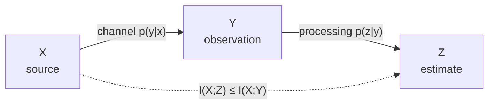
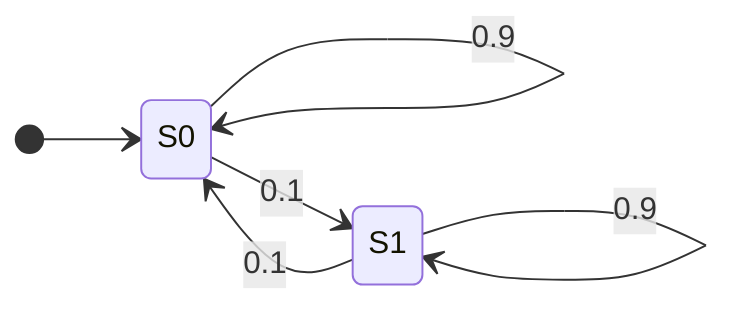

# Information Measures

Entropy, joint and conditional entropy, mutual information, relative entropy, and entropy rate.

Information theory is the mathematical study of how much *uncertainty* a random source carries, and therefore of how few bits are needed to describe it and how much of it can be pushed through a noisy channel. Claude Shannon founded the subject in his 1948 paper *A Mathematical Theory of Communication*, and its opening move is a deliberate act of abstraction: the meaning of a message is declared irrelevant. What remains is a probability distribution, and every quantity in this chapter is a functional of a distribution and nothing else.

This chapter builds the whole family of these functionals — entropy $H$, joint entropy, conditional entropy, mutual information $I$, and relative entropy $D$ — and proves the inequalities that tie them together. Two analytic facts do almost all the work: the concavity of the logarithm (Jensen's inequality) and its consequence, the *information inequality* $D(p\|q)\ge 0$. Everything else in the chapter is, in one way or another, an application of those two.

Throughout, $\log$ without a base means $\log_2$ and answers are in **bits**, unless a different base is announced.

## Surprisal: What Information Should Mean

<!-- section: what-is-information -->

Before measuring information we must decide what we are measuring. Information theory takes the position that information is *reduction of uncertainty*: an outcome you were already certain of tells you nothing, and the more unexpected an outcome is, the more you learn from observing it. That single sentence, taken seriously, forces the logarithm on us.

:::definition[Surprisal (self-information)]{#surprisal}
Let $X$ be a discrete random variable with probability mass function $p$. The **surprisal** of the outcome $x$ is

$$I(x) = \log_2 \frac{1}{p(x)} = -\log_2 p(x) \quad\text{bits},$$

defined for every $x$ with $p(x) > 0$.
:::

:::intuition
Surprisal answers "how astonished should I be?", measured in yes/no questions. If an event has probability $1/2^k$, then narrowing the world down to that event is exactly the work of $k$ successive halvings — $k$ coin flips' worth of news. A certain event ($p=1$) costs $0$ bits, and an event of probability $10^{-6}$ costs about $20$ bits.
:::

Why the logarithm specifically? Because we want surprisal to be *additive over independent observations*: hearing two unrelated pieces of news should inform you by the sum of their separate amounts. Combined with monotonicity and a little regularity, additivity pins the function down completely.

:::theorem[The logarithm is forced]{#surprisal-characterisation}
Suppose $f : (0,1] \to [0,\infty)$ satisfies

1. $f$ is monotone non-increasing (rarer events are no less informative),
2. $f(pq) = f(p) + f(q)$ for all $p,q \in (0,1]$ (independent events add), and
3. $f$ is not identically zero.

Then there is a constant $c>0$ with $f(p) = -c\log_2 p$ for all $p \in (0,1]$. Normalising by $f(1/2)=1$ gives $c=1$, i.e. $f(p) = -\log_2 p$.
:::

:::proof
Put $g(t) = f(2^{-t})$ for $t \ge 0$. Condition (2) becomes $g(s+t) = g(s)+g(t)$, Cauchy's functional equation, and condition (1) makes $g$ monotone non-decreasing. Additivity gives $g(n) = n\,g(1)$ for every positive integer $n$, and $m\,g(n/m) = g(n)$ forces $g(r) = r\,g(1)$ for every positive rational $r$. If $t$ is irrational, take rationals $r < t < s$; monotonicity gives $r\,g(1) \le g(t) \le s\,g(1)$, and letting $r \uparrow t$ and $s \downarrow t$ yields $g(t) = t\,g(1)$. Hence $f(2^{-t}) = t\,g(1)$, that is, $f(p) = -g(1)\log_2 p$. Condition (3) forces $g(1)\neq 0$ and monotonicity forces $g(1)>0$; set $c = g(1)$.
:::

Note how little was assumed. We did not ask for continuity — monotonicity alone rules out the pathological additive functions — and we did not ask for any particular scale. The base of the logarithm is a *choice of unit*, not a piece of mathematics.

:::notation
Base $2$ gives **bits** (also called *shannons*); base $e$ gives **nats**; base $10$ gives **bans** (or *hartleys*). Conversion is one multiplication, since $\log_b p = \log_a p/\log_a b$:

$$1 \text{ nat} = \log_2 e \approx 1.4427 \text{ bits}, \qquad 1 \text{ ban} = \log_2 10 \approx 3.3219 \text{ bits}.$$

Every identity and inequality in this chapter is base-independent, because changing base multiplies *every* term by the same positive constant.
:::

:::example[Surprisal of a lottery ticket]
A lottery has $1{,}000{,}000$ equally likely tickets. How many bits of information is the announcement "ticket #472913 won", and how many is "a ticket with an even number won"?
:::

:::solution
The winning ticket has probability $p = 10^{-6}$, so

$$I = -\log_2 10^{-6} = 6\log_2 10 \approx 19.93 \text{ bits}.$$

The second announcement has probability $\tfrac12$ and so carries $1$ bit. The two are consistent with additivity: telling you the parity ($1$ bit) and then the identity among the $500{,}000$ tickets of that parity ($\log_2 500{,}000 \approx 18.93$ bits) totals $19.93$ bits, exactly the surprisal of naming the ticket outright. □
:::

:::pitfall
Surprisal is a property of the *outcome*; entropy is a property of the *distribution*. Asking "what is the information in this sentence?" is ambiguous until you say which ensemble the sentence was drawn from. A string of $100$ random digits has high surprisal under the uniform model and essentially none under a model that puts all its mass on that string.
:::

## From Surprisal to Entropy: The Two Analytic Tools

<!-- section: quantifying-information -->

Surprisal attaches a number to each outcome. To attach one number to the *source*, average:

$$H(X) = \mathbb{E}\bigl[I(X)\bigr] = \sum_x p(x)\bigl(-\log_2 p(x)\bigr).$$

That is entropy, formalised in the next section. Before studying it we install the two analytic tools that every proof in this chapter uses. Both are statements about the concavity of $\log$, and it is worth seeing them once, cleanly, so that later arguments can be one line long.

:::theorem[Jensen's inequality]{#jensen}
Let $\varphi$ be a concave function on an interval $J$ and let $X$ be a random variable taking finitely many values in $J$. Then

$$\mathbb{E}\bigl[\varphi(X)\bigr] \le \varphi\bigl(\mathbb{E}[X]\bigr).$$

If $\varphi$ is *strictly* concave, equality holds if and only if $X$ is constant with probability $1$. For convex $\varphi$ the inequality reverses.
:::

:::proof
Induct on the size $n$ of the support. For $n=1$ both sides agree. Suppose the claim holds for supports of size $n-1$, and let $X$ take values $x_1,\dots,x_n$ with positive probabilities $p_1,\dots,p_n$. Write $q_i = p_i/(1-p_n)$ for $i<n$, so $\sum_{i<n} q_i = 1$, and set $\mu = \sum_{i<n} q_i x_i$. Concavity applied to the two-point combination $(1-p_n)\mu + p_n x_n$ gives

$$\varphi\Bigl(\sum_{i=1}^n p_i x_i\Bigr) = \varphi\bigl((1-p_n)\mu + p_n x_n\bigr) \ge (1-p_n)\varphi(\mu) + p_n \varphi(x_n),$$

and the induction hypothesis gives $\varphi(\mu) \ge \sum_{i<n} q_i\varphi(x_i)$. Substituting,

$$\varphi\Bigl(\sum_i p_i x_i\Bigr) \ge (1-p_n)\sum_{i<n}q_i\varphi(x_i) + p_n\varphi(x_n) = \sum_i p_i\varphi(x_i).$$

For the equality case, strict concavity makes the two-point step strict unless $\mu = x_n$, and the inductive step strict unless $x_1=\dots=x_{n-1}$; together these force all $x_i$ equal.
:::

:::intuition
A chord of a concave curve lies below the curve. Averaging the inputs and then bending ($\varphi(\mathbb{E}X)$) always lands at or above bending and then averaging ($\mathbb{E}\varphi(X)$). Since $\log$ is concave, "the log of an average is at least the average of the logs" — and that one sentence proves the information inequality, the bound $H \le \log|\mathcal{X}|$, and the data processing inequality.
:::

:::figure[The chord of $\log_2$ from $(1,0)$ to $(4,2)$ lies below the curve. At $x=2.5$ — the average of the two endpoints — the curve reads $1.322$ and the chord reads $1.000$; the $0.322$-bit gap is $\log_2\mathbb{E}[X]-\mathbb{E}[\log_2 X]$ for $X$ equal to $1$ or $4$ with probability $\tfrac12$ each.]{#jensen-figure}
{
  "type": "plot",
  "x": [0.0, 4.8],
  "y": [-2.2, 2.8],
  "xTicks": 1,
  "yTicks": 1,
  "xLabel": "x",
  "yLabel": "value",
  "marks": [
    { "kind": "function", "fn": "log(x)/log(2)", "tone": "accent" },
    { "kind": "line", "through": [[1, 0], [4, 2]], "tone": "result", "extend": false },
    { "kind": "point", "at": [1, 0] },
    { "kind": "point", "at": [4, 2] },
    { "kind": "point", "at": [2.5, 1.3219] },
    { "kind": "point", "at": [2.5, 1.0] },
    { "kind": "text", "at": [3.3, 2.5], "text": "y = log2 x", "leaderTo": [4.0, 2.0] },
    { "kind": "text", "at": [1.9, -1.0], "text": "chord: E[log2 X]", "leaderTo": [2.5, 1.0] },
    { "kind": "text", "at": [1.6, 2.4], "text": "curve: log2 E[X]", "leaderTo": [2.5, 1.3219] }
  ]
}
:::

The second tool is a workhorse form of the same fact, tailored to ratios of non-negative numbers. It is what makes convexity arguments about relative entropy short.

:::theorem[Log-sum inequality]{#log-sum}
Let $a_1,\dots,a_n$ and $b_1,\dots,b_n$ be non-negative numbers, and write $a = \sum_i a_i$, $b = \sum_i b_i$. Then

$$\sum_{i=1}^n a_i \log_2\frac{a_i}{b_i} \ \ge\ a\log_2\frac{a}{b},$$

with the conventions $0\log\tfrac{0}{b} = 0$ and $a\log\tfrac{a}{0} = \infty$ for $a>0$. Equality holds if and only if the ratio $a_i/b_i$ is the same for every $i$.
:::

:::proof
Assume all $a_i,b_i>0$; terms with $a_i=0$ contribute nothing to either side, and a zero $b_i$ with $a_i>0$ makes the left side infinite. The function $t \mapsto t\log_2 t$ is strictly convex on $(0,\infty)$, since its second derivative is $1/(t\ln 2) > 0$. Apply Jensen's inequality in its convex form to the random variable taking value $t_i = a_i/b_i$ with probability $\beta_i = b_i/b$:

$$\sum_i \beta_i\,t_i\log_2 t_i \ \ge\ \Bigl(\sum_i \beta_i t_i\Bigr)\log_2\Bigl(\sum_i \beta_i t_i\Bigr).$$

Now $\sum_i \beta_i t_i = \sum_i a_i/b = a/b$, and $\beta_i t_i \log_2 t_i = (a_i/b)\log_2(a_i/b_i)$. Multiplying through by $b$ gives exactly the claim. Strict convexity makes equality equivalent to the $t_i$ being constant.
:::

:::example[Two pieces of logarithmic arithmetic]
Convert $H = 1.75$ bits to nats, then evaluate $\sum_i a_i\log_2(a_i/b_i)$ for $a = (0.6,0.4)$ and $b = (0.3,0.7)$ and check it against the log-sum bound.
:::

:::solution
Bits to nats divides by $\log_2 e$: $1.75/1.4427 \approx 1.213$ nats.

For the sum, $\log_2 2 = 1$ and $\log_2(0.4/0.7) = \log_2 0.5714 \approx -0.8074$, so

$$0.6(1) + 0.4(-0.8074) \approx 0.600 - 0.323 = 0.277.$$

Here $a = b = 1$, so the log-sum bound reads $\ge 1\cdot\log_2 1 = 0$, and indeed $0.277 > 0$. The inequality is strict because $a_1/b_1 = 2 \neq 0.571 = a_2/b_2$. This instance is precisely the statement $D(a\|b) \ge 0$, proved in general in the relative entropy sections. □
:::

## What the Measures Are For, and What They Are Not

<!-- section: applications-scope -->

The quantities of this chapter are not free-floating definitions; each is the exact answer to an operational question. Stating those answers now explains why the definitions look the way they do, even though the full proofs belong to later chapters on source and channel coding.

:::theorem[Kraft inequality]{#kraft}
A prefix-free binary code with codeword lengths $\ell_1,\dots,\ell_m$ exists if and only if

$$\sum_{i=1}^m 2^{-\ell_i} \le 1.$$
:::

:::proof
($\Rightarrow$) Draw the infinite binary tree and let $\ell_{\max} = \max_i \ell_i$. A codeword of length $\ell_i$ occupies a node at depth $\ell_i$, and the prefix-free condition says no codeword node is an ancestor of another, so the sets of depth-$\ell_{\max}$ descendants of the codeword nodes are disjoint. The codeword of length $\ell_i$ has $2^{\ell_{\max}-\ell_i}$ such descendants and there are $2^{\ell_{\max}}$ nodes at that depth altogether, so $\sum_i 2^{\ell_{\max}-\ell_i} \le 2^{\ell_{\max}}$, which is the claim.

($\Leftarrow$) Sort the lengths $\ell_1 \le \dots \le \ell_m$ and assign to the $i$-th codeword the first $\ell_i$ binary digits of $\sum_{j<i} 2^{-\ell_j}$. The hypothesis keeps every partial sum below $1$, and for $j<i$ the two partial sums differ by at least $2^{-\ell_j}$, so the $j$-th codeword is not a prefix of the $i$-th.
:::

Kraft is the bridge between distributions and codes: given lengths satisfying the inequality, $q(x) = 2^{-\ell(x)}$ is a sub-probability distribution, and conversely any distribution $q$ suggests the lengths $\ell(x) = \lceil \log_2 1/q(x)\rceil$. *Every statement about code lengths in this chapter is a statement about distributions in disguise.*

:::theorem[Source coding theorem, one-shot form]{#source-coding}
Let $X$ have entropy $H(X)$ and let $L^{*}$ be the minimum expected length of a prefix-free binary code for $X$. Then

$$H(X) \le L^{*} < H(X) + 1.$$
:::

:::proof
For the lower bound, let $\ell$ be any prefix-free code, put $c = \sum_x 2^{-\ell(x)} \le 1$ and $q(x) = 2^{-\ell(x)}/c$. Then

$$\mathbb{E}[\ell(X)] - H(X) = \sum_x p(x)\log_2\frac{p(x)}{2^{-\ell(x)}} = D(p\|q) - \log_2 c,$$

which is non-negative because $D(p\|q)\ge 0$ by Gibbs' inequality and $\log_2 c \le 0$.

For the upper bound take $\ell(x) = \lceil\log_2 1/p(x)\rceil$. These lengths satisfy Kraft, since $2^{-\lceil\log_2 1/p(x)\rceil} \le p(x)$ and the $p(x)$ sum to $1$, and $\ell(x) < \log_2 1/p(x) + 1$, so the expected length is below $H(X)+1$.
:::

The trailing $+1$ is the rounding loss from insisting on whole-bit codewords; coding blocks of $n$ symbols at a time divides it by $n$, which is why entropy is the true limit asymptotically. The channel side of the theory has a matching statement, which we quote without proof.

:::theorem[Noisy channel coding theorem (quoted)]{#channel-coding}
For a discrete memoryless channel with transition law $p(y|x)$, define the capacity

$$C = \max_{p(x)} I(X;Y).$$

Then for every rate $R<C$ there are codes of rate $R$ whose probability of decoding error tends to $0$ as the block length grows, and for every $R>C$ the error probability is bounded away from $0$.
:::

:::note
The converse half of this theorem is within reach of this chapter: it follows from the data processing inequality and Fano's inequality, both stated and proved below. The achievability half — that good codes exist — rests on a random coding argument and the joint asymptotic equipartition property, and is out of scope here.
:::

:::intuition
Two numbers govern the whole enterprise. Entropy $H$ is *how much you must say*; capacity $C$, a maximised mutual information, is *how much can be heard*. Shannon's separation principle says that as long as $H < C$ you may compress down to $H$ and then protect the result up to $C$, losing nothing by doing the two jobs separately.
:::

:::example[Sizing a source]
A source emits symbols A, B, C with probabilities $0.5, 0.25, 0.25$. Estimate the size of a compressed file of $1000$ symbols and exhibit a code that achieves it.
:::

:::solution
The entropy is

$$H = 0.5\log_2 2 + 0.25\log_2 4 + 0.25\log_2 4 = 0.5 + 0.5 + 0.5 = 1.5 \text{ bits/symbol},$$

so $1000$ symbols need about $1500$ bits, or $188$ bytes. The code $\text{A}\mapsto 0$, $\text{B}\mapsto 10$, $\text{C}\mapsto 11$ is prefix-free with expected length $0.5(1)+0.25(2)+0.25(2) = 1.5$ bits, meeting the bound exactly. Equality is possible here precisely because every probability is a power of $\tfrac12$, so the ideal lengths $\log_2 1/p(x)$ are already integers and nothing is lost to rounding. □
:::

:::pitfall
Information measures say nothing about *meaning, value, or truth*. A megabyte of cryptographic noise has more entropy than a megabyte of Shakespeare, and a perfectly reliable channel carrying lies has full capacity. Shannon's framework deliberately quantifies only the statistical difficulty of reproducing a symbol stream.
:::

## Common Mistakes

- **Confusing information with meaning or importance.** Entropy measures statistical unpredictability. A random digit string can have maximal entropy and no significance whatsoever.
- **Reading a surprisal as an entropy.** $-\log_2 p(x)$ is attached to one outcome; $H(X)$ is its average. The rare outcome of a near-deterministic source has enormous surprisal while the source itself has almost no entropy.
- **Forgetting to fix a base.** Mixing $\log_2$ and $\ln$ in one calculation produces answers off by the factor $\ln 2 \approx 0.693$. Fix the base at the start and state the unit with every number.
- **Treating entropy as a property of a particular string.** Entropy belongs to a distribution; the individual-string analogue is Kolmogorov complexity, a different and uncomputable quantity.
- **Expecting a symbol code to reach $H$ exactly.** The gap in $H \le L^{*} < H+1$ is real and closes only when the probabilities are dyadic, or in the limit of long blocks.
- **Quoting capacity as a property of the input.** $C = \max_{p(x)} I(X;Y)$ maximises over inputs; it is a property of the *channel*.

Entropy is the central quantity of information theory: the average surprisal of a source, the number of bits per symbol that an ideal compressor needs, and — by the characterisation below — the only function of a distribution that behaves the way a measure of uncertainty ought to. The next three sections define it, establish its structural properties, and develop the habits needed to compute it.

## Definition of Entropy

<!-- section: definition -->

:::definition[Shannon entropy]{#entropy}
Let $X$ be a discrete random variable with values in a countable alphabet $\mathcal{X}$ and probability mass function $p$. The **entropy** of $X$ is

$$H(X) = -\sum_{x \in \mathcal{X}} p(x)\log_2 p(x) = \mathbb{E}\Bigl[\log_2\frac{1}{p(X)}\Bigr] \quad\text{bits}.$$

When $\mathcal{X}$ is infinite the series may diverge, in which case we write $H(X) = \infty$.
:::

:::notation
By convention $0\log 0 = 0$, which is the limit of $t\log t$ as $t \downarrow 0$. Outcomes of probability zero therefore contribute nothing, and the entropy of $X$ depends only on the list of positive probabilities — not on the alphabet from which they were drawn, not on their order, and not on the *values* the variable takes.
:::

That last point deserves emphasis: $H(X)$ is a function of $p$, not of $X$. The notation $H(X)$ is traditional and convenient but slightly misleading; a fair coin labelled $\{0,1\}$ and a fair coin labelled $\{-10^6, \pi\}$ have the same entropy, $1$ bit. This is exactly what distinguishes entropy from variance, which is sensitive to the numerical values and is not defined at all for an unordered alphabet.

:::intuition
Entropy is average surprise, and equivalently the expected number of yes/no questions an optimal questioner needs to identify the outcome. For a source over four equally likely symbols, two questions always suffice and never fewer: $H = 2$. For the source with probabilities $\tfrac12, \tfrac14, \tfrac18, \tfrac18$, the optimal strategy asks "is it the first symbol?" first and averages $1.75$ questions.
:::

:::example[Entropy of a biased coin]
Compute the entropy of a coin with $P(\text{heads}) = 0.9$.
:::

:::solution
$$H = -0.9\log_2 0.9 - 0.1\log_2 0.1 = 0.9(0.15200) + 0.1(3.32193) \approx 0.137 + 0.332 = 0.469 \text{ bits}.$$

Sanity check: the answer lies strictly between $0$ (a two-headed coin) and $1$ (a fair coin), as it must for a biased but not deterministic coin. Operationally, a long sequence of these flips can be compressed to about $469$ bits per thousand flips. □
:::

The characterisation below explains why this particular formula, rather than some other decreasing function of predictability, is *the* measure of uncertainty. Its content is that entropy is forced by a grouping axiom: it should not matter whether you reveal an outcome all at once or in stages.

:::theorem[Shannon's characterisation of entropy (proof sketched)]{#entropy-characterisation}
Let $H_n(p_1,\dots,p_n)$ be defined for every probability vector and suppose

1. $H_2(p, 1-p)$ is continuous in $p$,
2. $H_n(1/n,\dots,1/n)$ is increasing in $n$, and
3. (grouping) for $p_1 = q_1 + q_2$,

$$H_n(q_1, q_2, p_2, \dots, p_{n-1}) = H_{n-1}(p_1, p_2,\dots,p_{n-1}) + p_1\,H_2\Bigl(\frac{q_1}{p_1}, \frac{q_2}{p_1}\Bigr).$$

Then $H_n(p_1,\dots,p_n) = -c\sum_i p_i\log_2 p_i$ for some constant $c > 0$.
:::

:::proof
*Sketch.* Write $A(n) = H_n(1/n,\dots,1/n)$. Repeatedly applying the grouping axiom to split a uniform distribution on $mn$ points into $m$ groups of $n$ gives $A(mn) = A(m) + A(n)$, so $A$ is an additive, increasing function on the integers; the argument used for the surprisal characterisation gives $A(n) = c\log_2 n$. Grouping then extends this from uniform distributions to rational probability vectors, by realising a vector with denominators $n$ as a grouping of the uniform distribution on $n$ points, and continuity (1) passes to arbitrary real vectors. The full bookkeeping is standard but long, and we do not reproduce it; the essential step is the one displayed above.
:::

:::remark
Several inequivalent axiom sets give the same conclusion, and none of them is the reason entropy matters. The decisive argument is operational: Theorem *Source coding theorem, one-shot form* says entropy is the minimum achievable description length, and no other functional has that property. Axioms explain the formula; coding theorems justify it.
:::

## Properties of Entropy

<!-- section: properties -->

Everything in this section is proved from the definition together with Jensen's inequality. Each item will be used repeatedly later.

:::theorem[Range of entropy]{#entropy-range}
Let $X$ take values in a finite alphabet $\mathcal{X}$. Then

$$0 \le H(X) \le \log_2|\mathcal{X}|.$$

The left equality holds if and only if $X$ is deterministic; the right equality holds if and only if $X$ is uniform on $\mathcal{X}$.
:::

:::proof
Each term $-p(x)\log_2 p(x)$ is non-negative because $p(x) \in [0,1]$ makes $\log_2 p(x) \le 0$, so $H(X)\ge 0$. The sum vanishes only if every term does, i.e. every $p(x)$ is $0$ or $1$, which means $X$ is deterministic.

For the upper bound apply Jensen's inequality to the concave function $\log_2$ and the random variable $1/p(X)$:

$$H(X) = \mathbb{E}\Bigl[\log_2\frac{1}{p(X)}\Bigr] \le \log_2 \mathbb{E}\Bigl[\frac{1}{p(X)}\Bigr] = \log_2 \sum_{x: p(x)>0} 1 = \log_2 |\text{supp}(p)| \le \log_2|\mathcal{X}|.$$

Since $\log_2$ is strictly concave, the first inequality is an equality only when $1/p(X)$ is constant, i.e. $p$ is uniform on its support, and the second only when the support is all of $\mathcal{X}$.
:::

:::intuition
Uncertainty is largest when you have no idea at all, and "no idea at all" means uniform. Entropy is bounded by the log of the number of *possible* outcomes, which is why an alphabet of $256$ symbols can never carry more than $8$ bits per symbol however cleverly it is used.
:::

One special case of the entropy formula recurs so often that it gets its own symbol.

:::figure[The binary entropy $h(p)$. It vanishes at the deterministic ends $p=0$ and $p=1$, peaks at $h(\tfrac12)=1$ bit, and is concave throughout — so a mixture of two coins is never more predictable than the mixture of their entropies.]{#binary-entropy-figure}
{
  "type": "plot",
  "x": [0.0, 1.0],
  "y": [0.0, 1.25],
  "xTicks": 0.25,
  "yTicks": 0.25,
  "xLabel": "p",
  "yLabel": "h(p) in bits",
  "marks": [
    { "kind": "function", "fn": "-x*log(x)/log(2)-(1-x)*log(1-x)/log(2)", "tone": "accent" },
    { "kind": "point", "at": [0.5, 1.0] },
    { "kind": "point", "at": [0.1, 0.4690] },
    { "kind": "point", "at": [0.25, 0.8113] },
    { "kind": "text", "at": [0.5, 1.18], "text": "max = 1 bit at p = 1/2" },
    { "kind": "text", "at": [0.17, 0.16], "text": "h(0.1) = 0.469", "leaderTo": [0.1, 0.469] },
    { "kind": "text", "at": [0.72, 0.62], "text": "h(0.25) = 0.811", "leaderTo": [0.25, 0.8113] }
  ]
}
:::

:::definition[Binary entropy function]{#binary-entropy}
For $p \in [0,1]$,

$$h(p) = -p\log_2 p - (1-p)\log_2(1-p),$$

the entropy of a single bit that equals $1$ with probability $p$. It satisfies $h(p) = h(1-p)$, $h(0) = h(1) = 0$, and $h(1/2) = 1$.
:::

:::theorem[Concavity of entropy]{#entropy-concavity}
Regarded as a function of the probability vector $p$ on a fixed finite alphabet, $H$ is concave: for distributions $p_1, p_2$ and $\lambda \in [0,1]$,

$$H\bigl(\lambda p_1 + (1-\lambda)p_2\bigr) \ge \lambda H(p_1) + (1-\lambda)H(p_2).$$
:::

:::proof
The map $t\mapsto -t\log_2 t$ is concave on $[0,1]$, since its second derivative is $-1/(t\ln 2) < 0$. Entropy is the sum over $x$ of this concave function applied to the coordinate $p(x)$, and a sum of concave functions of an affine argument is concave. Explicitly, for each $x$,

$$-\bigl(\lambda p_1(x)+(1-\lambda)p_2(x)\bigr)\log_2\bigl(\lambda p_1(x)+(1-\lambda)p_2(x)\bigr) \ge -\lambda p_1(x)\log_2 p_1(x) - (1-\lambda)p_2(x)\log_2 p_2(x),$$

and summing over $x$ gives the result.
:::

:::intuition
Mixing two sources cannot make the result more predictable than the average of the two, because a mixture hides *which* source produced each symbol — and that hidden label is itself uncertainty. The probabilistic reading is exact: if $Z$ picks source $1$ or $2$ and $X$ is drawn from the chosen source, then $H(X) \ge H(X|Z) = \lambda H(p_1)+(1-\lambda)H(p_2)$, which is concavity restated.
:::

:::theorem[Deterministic processing cannot increase entropy]{#entropy-function-bound}
For any function $f$ defined on the alphabet of $X$,

$$H(f(X)) \le H(X),$$

with equality if and only if $f$ is injective on the support of $p$.
:::

:::proof
Let $Y = f(X)$. Since $Y$ is determined by $X$ we have $H(Y|X) = 0$, so the chain rule (Theorem *Chain rule for entropy*) gives

$$H(X) = H(X,Y) = H(Y) + H(X|Y) \ge H(Y),$$

because conditional entropy is non-negative. Equality forces $H(X|Y) = 0$, i.e. $X$ is determined by $Y$ almost surely, which for a deterministic $f$ means $f$ is injective on the support.
:::

:::pitfall
The inequality $H(f(X)) \le H(X)$ needs $f$ to be *deterministic*. If you add independent noise — $Y = X \oplus N$ with $N$ a random bit — then $H(Y)$ can exceed $H(X)$. Random processing can create entropy; it just cannot create *information about $X$*, which is the content of the data processing inequality.
:::

:::example[Where entropy sits for small alphabets]
For which $p$ does a three-symbol source with probabilities $(p, p, 1-2p)$ have maximal entropy, and what is the maximum?
:::

:::solution
By Theorem *Range of entropy* the maximum over *all* distributions on three symbols is $\log_2 3 \approx 1.585$, attained only at the uniform distribution. The family $(p,p,1-2p)$ contains the uniform distribution at $p = 1/3$, so the maximum over the family is $\log_2 3$ at $p = 1/3$.

Checking directly: $H(p) = -2p\log_2 p - (1-2p)\log_2(1-2p)$, and $\frac{dH}{dp} = 2\log_2\frac{1-2p}{p}$, which vanishes exactly when $1-2p = p$, i.e. $p = 1/3$. The two routes agree, and the derivative test confirms it is a maximum since $H'$ changes from positive to negative there. □
:::

## Calculating Entropy

<!-- section: calculating -->

:::recipe[Computing an entropy from a pmf]
1. List every outcome with positive probability and its probability $p(x)$.
2. Compute the surprisal $-\log_2 p(x)$ of each. (Useful values: $-\log_2 \tfrac12 = 1$, $-\log_2\tfrac14 = 2$, $-\log_2 0.1 \approx 3.3219$, $-\log_2 0.3 \approx 1.7370$, $-\log_2 0.9 \approx 0.1520$.)
3. Form the weighted sum $H = \sum_x p(x)\bigl(-\log_2 p(x)\bigr)$.
4. Check $0 \le H \le \log_2 k$, where $k$ is the number of outcomes with positive probability, and check that $H$ is well below $\log_2 k$ when the distribution is visibly lopsided.
:::

A short table of reference values is worth memorising, because most exercises reduce to one of them.

| Distribution | Probabilities | Entropy (bits) |
|---|---|---|
| Deterministic | $(1)$ | $0$ |
| Fair coin | $(\tfrac12,\tfrac12)$ | $1$ |
| Biased coin | $(0.9, 0.1)$ | $\approx 0.469$ |
| Uniform on $4$ | $(\tfrac14,\tfrac14,\tfrac14,\tfrac14)$ | $2$ |
| Dyadic | $(\tfrac12,\tfrac14,\tfrac18,\tfrac18)$ | $1.75$ |
| Uniform on $n$ | $(1/n,\dots,1/n)$ | $\log_2 n$ |

:::example[A four-symbol source]
Symbols $A,B,C,D$ occur with probabilities $0.4, 0.3, 0.2, 0.1$. Find $H$.
:::

:::solution
The surprisals are $1.3219$, $1.7370$, $2.3219$, $3.3219$ bits. Weighting,

$$H \approx 0.4(1.3219) + 0.3(1.7370) + 0.2(2.3219) + 0.1(3.3219) = 0.5288 + 0.5211 + 0.4644 + 0.3322 = 1.846 \text{ bits}.$$

Sanity check: $0 < 1.846 < \log_2 4 = 2$, with the gap from $2$ reflecting the mild non-uniformity. □
:::

Infinite alphabets need a closed form rather than a table. The geometric distribution is the standard example, and its entropy is computable exactly.

:::proposition[Entropy of a geometric distribution]{#geometric-entropy}
Let $P(X = k) = (1-p)^{k-1}p$ for $k = 1,2,\dots$, with $p\in(0,1)$. Then

$$H(X) = \frac{h(p)}{p} \quad\text{bits},$$

where $h$ is the binary entropy function.
:::

:::proof
Write $q = 1-p$. Then

$$H(X) = -\sum_{k\ge 1} q^{k-1}p\,\log_2\bigl(q^{k-1}p\bigr) = -\sum_{k\ge 1} q^{k-1}p\bigl[(k-1)\log_2 q + \log_2 p\bigr].$$

The second piece sums to $-\log_2 p$ since the probabilities total $1$. For the first, $\sum_{k\ge1}(k-1)q^{k-1}p = \mathbb{E}[X]-1 = 1/p - 1 = q/p$. Hence

$$H(X) = -\frac{q}{p}\log_2 q - \log_2 p = \frac{-q\log_2 q - p\log_2 p}{p} = \frac{h(p)}{p}.$$
:::

:::example[Reading the geometric formula]
How many bits are needed on average to encode the number of fair coin flips until the first head?
:::

:::solution
Here $p = 1/2$, so $H = h(1/2)/(1/2) = 1/0.5 = 2$ bits. The unary code — $k-1$ zeros followed by a one — has expected length $\mathbb{E}[X] = 2$ bits and is therefore optimal, which we can confirm against the source coding theorem: $H = 2 \le L^* = 2 < 3$. Equality is possible because every probability $2^{-k}$ is dyadic. □
:::

:::intuition
Two forces set the size of $H$: how many outcomes are in play (which raises the ceiling $\log_2 k$) and how unevenly the mass is spread (which pushes $H$ below the ceiling). A distribution over a million symbols with $99.9\%$ of its mass on one of them has entropy well under a bit.
:::

## Common Mistakes

- **Dropping the minus sign.** $\sum p\log p$ is negative; entropy is its negative. If your answer is negative, you dropped the sign.
- **Leaving $0\log 0$ undefined in code.** Mathematically it is $0$; in a program it is `NaN`. Guard the zero-probability terms explicitly.
- **Confusing the entropy of $p$ with a statistic of a sample.** $H$ is a functional of the distribution. What you compute from a finite sample is an *estimate*, and the plug-in estimate is biased downwards.
- **Assuming the maximum entropy on an alphabet is always attained.** It is — at the uniform distribution — but only when the whole alphabet is in the support. A distribution supported on $3$ of $8$ symbols is capped at $\log_2 3$, not $3$.
- **Thinking entropy measures spread in the numerical sense.** Relabelling the outcomes changes the variance and leaves the entropy untouched.
- **Using the single-symbol entropy for a source with memory.** That is an upper bound on the true per-symbol cost; the entropy rate of the final sections is the correct quantity.

A source rarely emits one symbol in isolation. Joint entropy extends $H$ to a vector of random variables and is the quantity that the rest of the chapter is built on: conditional entropy, mutual information, and entropy rate are all differences of joint entropies.

## Joint Entropy

<!-- section: definition-joint -->

:::definition[Joint entropy]{#joint-entropy}
Let $(X,Y)$ be a pair of discrete random variables with joint pmf $p(x,y)$. Their **joint entropy** is

$$H(X,Y) = -\sum_{x,y} p(x,y)\log_2 p(x,y) = \mathbb{E}\Bigl[\log_2\frac{1}{p(X,Y)}\Bigr].$$

More generally, for $X_1,\dots,X_n$,

$$H(X_1,\dots,X_n) = -\sum_{x_1,\dots,x_n} p(x_1,\dots,x_n)\log_2 p(x_1,\dots,x_n).$$
:::

There is nothing new here: $H(X,Y)$ is the ordinary entropy of the single random variable $(X,Y)$ taking values in $\mathcal{X}\times\mathcal{Y}$. Everything proved for $H$ therefore applies at once — it is non-negative, it is bounded by $\log_2$ of the size of the joint support, and it is concave in the joint distribution.

:::intuition
Treat the pair as one bigger die. $H(X,Y)$ is the average surprise of seeing both coordinates at once, or equivalently the number of bits a compressor needs per *pair*. If the two coordinates are related, many cells of the table are empty or nearly so, and the pair is cheaper to describe than the two coordinates separately.
:::

:::example[Independent versus coupled bits]
Compute $H(X,Y)$ for (a) two independent fair bits, and (b) the pair with $p(0,0) = p(1,1) = 0.4$, $p(0,1) = p(1,0) = 0.1$.
:::

:::solution
(a) All four cells have probability $\tfrac14$, so $H(X,Y) = \log_2 4 = 2$ bits.

(b) Two cells hold $0.4$ and two hold $0.1$:

$$H(X,Y) = -2(0.4)\log_2 0.4 - 2(0.1)\log_2 0.1 = 0.8(1.3219) + 0.2(3.3219) \approx 1.058 + 0.664 = 1.722 \text{ bits}.$$

Both marginals are fair bits in each case, so both pairs have $H(X)+H(Y) = 2$. The coupled pair costs $1.722$ bits rather than $2$ — the $0.278$-bit saving is exactly the mutual information we compute later. □
:::

:::pitfall
To evaluate $H(X,Y)$ you must use the *joint* probabilities $p(x,y)$, never the product $p(x)p(y)$ of the marginals. Substituting the product silently computes $H(X)+H(Y)$, which is an upper bound and is correct only under independence.
:::

## Joint Entropy Against Its Marginals

<!-- section: relation-to-marginals -->

Two bounds sandwich the joint entropy between the largest marginal and the sum of the marginals. The lower bound says adding a variable never helps; the upper bound — subadditivity — says dependence always saves.

:::theorem[Subadditivity and monotonicity]{#joint-bounds}
For any pair of discrete random variables,

$$\max\bigl(H(X), H(Y)\bigr) \ \le\ H(X,Y) \ \le\ H(X) + H(Y).$$

The left equality holds iff one variable is a deterministic function of the other (specifically $H(X,Y) = H(X)$ iff $Y = f(X)$ almost surely); the right equality holds iff $X$ and $Y$ are independent.
:::

:::proof
*Lower bound.* $X$ is a function of the pair $(X,Y)$, so Theorem *Deterministic processing cannot increase entropy* gives $H(X) \le H(X,Y)$; the same applies to $Y$. Equality $H(X,Y) = H(X)$ requires that $(X,Y)$ be recoverable from $X$, i.e. $Y$ is determined by $X$.

*Upper bound.* Compute the difference directly:

$$H(X)+H(Y)-H(X,Y) = \sum_{x,y} p(x,y)\log_2\frac{p(x,y)}{p(x)p(y)} = D\bigl(p(x,y)\,\big\|\,p(x)p(y)\bigr) \ge 0$$

by Gibbs' inequality, since $p(x)p(y)$ is a probability distribution on $\mathcal{X}\times\mathcal{Y}$. Gibbs' equality case forces $p(x,y) = p(x)p(y)$ everywhere, i.e. independence.

(To see the first equality, expand $\log_2 p(x)$ using $\sum_y p(x,y) = p(x)$: $H(X) = -\sum_{x,y}p(x,y)\log_2 p(x)$, and similarly for $Y$.)
:::

:::intuition
Describing $X$ and $Y$ separately costs $H(X)+H(Y)$ bits. Describing them together can only be cheaper, because a joint description can exploit the fact that some combinations never occur. The saving is the mutual information, and it is zero exactly when there is nothing to exploit.
:::

:::example[When the joint collapses to a marginal]
Let $X$ be uniform on $\{0,1,2,3\}$ and $Y = X \bmod 2$. Verify both bounds.
:::

:::solution
$H(X) = \log_2 4 = 2$ and $H(Y) = 1$, since $Y$ is a fair bit. The joint puts mass $\tfrac14$ on each of $(0,0),(1,1),(2,0),(3,1)$ and zero elsewhere, so $H(X,Y) = \log_2 4 = 2$ bits.

Lower bound: $\max(2,1) = 2 = H(X,Y)$ — equality, exactly as predicted, because $Y = f(X)$.
Upper bound: $H(X)+H(Y) = 3 > 2$ — strict, because the variables are as dependent as possible.
The shortfall $3 - 2 = 1$ bit is $I(X;Y) = H(Y)$: knowing $X$ resolves $Y$ entirely. □
:::

The upper bound extends to any number of variables, and the proof is a clean induction once the chain rule is available.

:::corollary[Independence bound]{#independence-bound}
For any $X_1,\dots,X_n$,

$$H(X_1,\dots,X_n) \le \sum_{i=1}^n H(X_i),$$

with equality if and only if the $X_i$ are mutually independent.
:::

:::proof
By the chain rule, $H(X_1,\dots,X_n) = \sum_i H(X_i \mid X_1,\dots,X_{i-1})$, and each term satisfies $H(X_i \mid X_1,\dots,X_{i-1}) \le H(X_i)$ by Theorem *Conditioning reduces entropy*. Summing gives the bound. Equality requires every term to be tight, i.e. $X_i$ independent of $(X_1,\dots,X_{i-1})$ for each $i$, which is exactly mutual independence.
:::

## The Chain Rule

<!-- section: chain-rule -->

The chain rule is the single most used identity in the subject. It is the entropy translation of the probability factorisation $p(x,y) = p(x)p(y|x)$, and it turns every joint quantity into a telescoping sum of one-symbol conditional quantities.

:::theorem[Chain rule for entropy]{#chain-rule-thm}
For discrete random variables $X_1,\dots,X_n$,

$$H(X_1, X_2, \dots, X_n) = \sum_{i=1}^{n} H\bigl(X_i \mid X_1, \dots, X_{i-1}\bigr),$$

where the $i=1$ term is $H(X_1)$. In particular $H(X,Y) = H(X) + H(Y|X) = H(Y) + H(X|Y)$.
:::

:::proof
For the two-variable case, factor the joint pmf and split the logarithm:

$$H(X,Y) = -\sum_{x,y} p(x,y)\log_2\bigl(p(x)p(y|x)\bigr) = -\sum_{x,y}p(x,y)\log_2 p(x) - \sum_{x,y}p(x,y)\log_2 p(y|x).$$

The first sum is $-\sum_x p(x)\log_2 p(x) = H(X)$, and the second is $H(Y|X)$ by definition. Symmetry of $H(X,Y)$ in its arguments gives the other factorisation.

For general $n$, induct. Applying the two-variable rule with $X = (X_1,\dots,X_{n-1})$ and $Y = X_n$,

$$H(X_1,\dots,X_n) = H(X_1,\dots,X_{n-1}) + H(X_n \mid X_1,\dots,X_{n-1}),$$

and the induction hypothesis expands the first term. Alternatively, write $p(x_1,\dots,x_n) = \prod_i p(x_i|x_1,\dots,x_{i-1})$, take $-\log_2$, and average.
:::

:::intuition
Describe the sequence one symbol at a time. The first symbol costs $H(X_1)$ bits; after that, each symbol costs only what is still unknown about it given everything already sent. Total cost is the sum — and it is the same total whatever order you choose to send them in, which is a genuinely useful degree of freedom.
:::

:::corollary[Conditional chain rule]{#conditional-chain-rule}
For discrete $X$, $Y$, $Z$,

$$H(X,Y \mid Z) = H(X\mid Z) + H(Y \mid X, Z).$$
:::

:::proof
Apply the two-variable chain rule to the conditional distribution given $Z = z$, obtaining $H(X,Y|Z=z) = H(X|Z=z) + H(Y|X,Z=z)$, then average over $z$ with weights $p(z)$. Each term averages to the corresponding conditional entropy by definition.
:::

:::example[Chain rule in both directions]
Suppose $H(X) = 2$, $H(Y) = 3$ and $H(X,Y) = 4$ bits. Find $H(Y|X)$ and $H(X|Y)$, and say which variable is more informative about the other.
:::

:::solution
Rearranging the chain rule, $H(Y|X) = H(X,Y) - H(X) = 4 - 2 = 2$ bits and $H(X|Y) = H(X,Y) - H(Y) = 4 - 3 = 1$ bit.

The *reductions* are what matter: $H(X) - H(X|Y) = 1$ and $H(Y) - H(Y|X) = 1$. They agree, as they must — both equal $I(X;Y) = 1$ bit. So neither variable is more informative about the other; mutual information is symmetric even though the conditional entropies differ. The asymmetry in $H(Y|X) = 2$ versus $H(X|Y) = 1$ reflects only that $Y$ was more uncertain to begin with. □
:::

:::pitfall
Do not read "$H(X|Y) < H(Y|X)$" as "$Y$ tells you more about $X$ than $X$ does about $Y$". Conditional entropies measure what is *left over*, and are not comparable across variables with different marginal entropies. The symmetric measure of shared information is $I(X;Y)$.
:::

## Common Mistakes

- **Writing $H(X,Y) = H(X)+H(Y)$ unconditionally.** That is the independence case only; in general the sum is an upper bound.
- **Confusing joint entropy with mutual information.** $H(X,Y)$ is the total; $I(X;Y) = H(X)+H(Y)-H(X,Y)$ is the overlap.
- **Assuming the joint support is the full product $\mathcal{X}\times\mathcal{Y}$.** Dependence empties cells, and $H(X,Y) \le \log_2(\text{number of occupied cells})$ can be far below $\log_2(|\mathcal{X}||\mathcal{Y}|)$.
- **Reversing the chain rule.** It is $H(X,Y) = H(X) + H(Y|X)$, never $H(X) + H(X|Y)$. Check that the conditioning variable is the one already "paid for".
- **Expanding in an order that makes life hard.** The chain rule holds in every order; choose the one whose conditionals you actually know.
- **Forgetting that the chain rule conditions gracefully.** Every identity here remains true with an extra $\mid Z$ attached to every term.

Conditional entropy measures how much uncertainty about $Y$ survives once $X$ has been observed. It is the information-theoretic counterpart of residual variance in regression, and it is the quantity that turns entropy from a static measure of a source into a measure of *prediction difficulty*.

## Definition of Conditional Entropy

<!-- section: definition-conditional -->

There are two objects here, and keeping them apart prevents most of the errors people make with conditional entropy.

:::definition[Conditional entropy]{#conditional-entropy}
For a fixed value $x$ with $p(x)>0$, the entropy of the conditional distribution $p(\cdot\mid x)$ is

$$H(Y \mid X = x) = -\sum_y p(y|x)\log_2 p(y|x).$$

The **conditional entropy** of $Y$ given $X$ is its average over $x$:

$$H(Y\mid X) = \sum_x p(x)\,H(Y\mid X = x) = -\sum_{x,y}p(x,y)\log_2 p(y|x) = \mathbb{E}\Bigl[\log_2\frac{1}{p(Y|X)}\Bigr].$$
:::

$H(Y\mid X=x)$ is a function of $x$ — a different number for each observation. $H(Y\mid X)$ is a single number, the $p(x)$-weighted average. The theorems of this chapter are about the average; none of them holds value by value.

:::note
By the chain rule, $H(Y|X) = H(X,Y)-H(X)$, and in practice this is usually the fastest route to a number: build the joint, take the marginal, subtract. The definitional form is the one to use when the conditional distributions are what you are given, as with a channel specified by its transition probabilities.
:::

:::intuition
After looking at $X$, how many more bits do you still need to pin down $Y$? If $X$ is the month and $Y$ tomorrow's temperature, $H(Y|X)$ is the uncertainty left after the calendar has told you what it can. A perfect predictor drives it to $0$; a useless one leaves it at $H(Y)$.
:::

:::example[An asymmetric channel]
Let $X$ be a fair bit. If $X=0$ then $Y=0$ with certainty; if $X=1$ then $Y$ is an independent fair bit. Find $H(Y|X)$, $H(X,Y)$, $H(Y)$ and $H(X|Y)$.
:::

:::solution
Value by value: $H(Y|X{=}0) = 0$ because $Y$ is deterministic there, and $H(Y|X{=}1) = h(1/2) = 1$. Averaging,

$$H(Y|X) = \tfrac12(0)+\tfrac12(1) = 0.5 \text{ bits}.$$

The joint pmf is $p(0,0)=\tfrac12$, $p(1,0)=\tfrac14$, $p(1,1)=\tfrac14$, so $H(X,Y) = \tfrac12(1)+\tfrac14(2)+\tfrac14(2) = 1.5$ bits. Since $H(X)=1$, the chain rule confirms $H(Y|X)=1.5-1=0.5$.

Going the other way: $P(Y{=}0)=\tfrac34$ and $P(Y{=}1)=\tfrac14$, so $H(Y) = h(1/4) \approx 0.811$ bits and $H(X|Y) = H(X,Y)-H(Y) \approx 1.5-0.811 = 0.689$ bits.

Sanity check: both conditional entropies are non-negative and each is below the corresponding marginal ($0.5 < 0.811$ and $0.689 < 1$), and the two reductions agree: $H(Y)-H(Y|X) \approx 0.311$ and $H(X)-H(X|Y) \approx 0.311$. That common value is $I(X;Y)$. □
:::

:::example[The deterministic extreme]
If $Y = X$ exactly, then given $X=x$ the variable $Y$ is a point mass, so $H(Y|X=x)=0$ for every $x$ and hence $H(Y|X)=0$. More generally $H(Y|X)=0$ if and only if $Y$ is a deterministic function of $X$ with probability $1$.
:::

:::solution
One direction is the computation above. Conversely, $H(Y|X)=0$ forces $H(Y|X=x)=0$ for every $x$ with $p(x)>0$, since the average of non-negative numbers vanishes only when each does; and an entropy vanishes only for a point mass (Theorem *Range of entropy*). So for each such $x$ there is a value $f(x)$ with $p(f(x)|x)=1$, and $Y=f(X)$ almost surely. □
:::

## Conditioning Reduces Entropy, and Fano's Inequality

<!-- section: interpretation-properties -->

:::theorem[Conditioning reduces entropy]{#conditioning-reduces-entropy}
For any discrete $X$, $Y$,

$$0 \le H(Y\mid X) \le H(Y),$$

with $H(Y|X)=H(Y)$ if and only if $X$ and $Y$ are independent. More generally, conditioning on more can only help:

$$H(Y \mid X, Z) \le H(Y\mid X).$$
:::

:::proof
Non-negativity is immediate, since $H(Y|X)$ is an average of entropies and each is non-negative. For the upper bound, subadditivity (Theorem *Subadditivity and monotonicity*) gives $H(X,Y)\le H(X)+H(Y)$, and the chain rule rewrites the left side as $H(X)+H(Y|X)$; cancelling $H(X)$ leaves $H(Y|X)\le H(Y)$. The equality case is the equality case of subadditivity, namely independence.

For the second claim, apply the first to the conditional distributions given $Z=z$: $H(Y|X,Z=z)\le H(Y|Z=z)$ holds for each $z$. Averaging over $z$ gives $H(Y|X,Z)\le H(Y|Z)$; relabelling the roles of $X$ and $Z$ gives the stated form.
:::

:::pitfall
"Conditioning reduces entropy" is a statement about the **average** $H(Y|X)$, not about individual values. It is entirely possible that $H(Y\mid X=x) > H(Y)$ for some particular $x$: a specific observation can leave you *more* confused than you were. Concretely, let $P(X{=}a)=0.8$ with $P(Y{=}1\mid X{=}a)=1$, and $P(X{=}b)=0.2$ with $P(Y{=}1\mid X{=}b)=\tfrac12$. Then $P(Y{=}1)=0.8(1)+0.2(0.5)=0.9$, so $H(Y)=h(0.9)\approx 0.469$, while $H(Y\mid X{=}b)=1 > H(Y)$. The average is safe: $H(Y\mid X)=0.8(0)+0.2(1)=0.2 \le 0.469$.
:::

:::intuition
Data can only help on average. A measurement that turns out to be misleading is always possible, but the ensemble of measurements you might have made cannot, in aggregate, make you worse off — because the prior is itself the average of the posteriors.
:::

The most important consequence of conditional entropy is a quantitative link between uncertainty and *guessing error*. If $H(Y|X)$ is large, no estimator of $Y$ from $X$ can be reliable. Fano's inequality makes this precise and is the engine of every converse in information theory.

:::theorem[Fano's inequality]{#fano}
Let $Y$ take values in a finite alphabet $\mathcal{Y}$, let $X$ be any random variable, and let $\hat Y = g(X)$ be any estimator of $Y$ computed from $X$. Write $P_e = P(\hat Y \neq Y)$. Then

$$H(Y \mid X) \ \le\ h(P_e) + P_e \log_2\bigl(|\mathcal{Y}| - 1\bigr) \ \le\ 1 + P_e\log_2|\mathcal{Y}|.$$

Consequently

$$P_e \ \ge\ \frac{H(Y\mid X) - 1}{\log_2 |\mathcal{Y}|}.$$
:::

:::proof
Introduce the error indicator $E = \mathbf{1}\{\hat Y \neq Y\}$, a random variable determined by $(Y,\hat Y)$. Expand $H(E,Y\mid \hat Y)$ with the conditional chain rule in two ways:

$$H(E,Y\mid\hat Y) = \underbrace{H(E\mid \hat Y)}_{\le\, h(P_e)} + H(Y\mid E,\hat Y) = \underbrace{H(Y\mid\hat Y)}_{\text{what we want}} + \underbrace{H(E\mid Y,\hat Y)}_{=\,0},$$

the last term vanishing because $E$ is a function of $(Y,\hat Y)$, and the first being at most $H(E) = h(P_e)$ since conditioning reduces entropy.

For the middle term, split on the value of $E$:

$$H(Y\mid E,\hat Y) = P(E{=}0)\,H(Y\mid \hat Y, E{=}0) + P(E{=}1)\,H(Y\mid\hat Y,E{=}1).$$

Given $E=0$ we have $Y=\hat Y$, so that entropy is $0$. Given $E=1$ and $\hat Y = \hat y$, the variable $Y$ ranges over the $|\mathcal{Y}|-1$ values other than $\hat y$, so its entropy is at most $\log_2(|\mathcal{Y}|-1)$. Hence $H(Y|E,\hat Y) \le P_e\log_2(|\mathcal Y|-1)$ and

$$H(Y\mid\hat Y) \le h(P_e) + P_e\log_2(|\mathcal Y|-1).$$

Finally, since $\hat Y = g(X)$ is a function of $X$, conditioning on $X$ is at least as informative as conditioning on $\hat Y$: $H(Y\mid X) = H(Y\mid X,\hat Y) \le H(Y\mid \hat Y)$, the equality because $\hat Y$ adds nothing to $X$ and the inequality because conditioning reduces entropy. The weaker second form follows from $h(P_e)\le 1$ and $\log_2(|\mathcal Y|-1) \le \log_2|\mathcal Y|$, and rearranging gives the bound on $P_e$.
:::

:::intuition
Fano says uncertainty is a floor on error. If, after seeing everything you get to see, one bit of uncertainty about a binary $Y$ remains, then no decision rule can do better than coin-flipping. Turned around: a decoder that is nearly always right is proof that almost no conditional entropy was left.
:::

:::example[Fano in action]
A message $Y$ is uniform on $256$ possibilities. After a noisy observation $X$, the residual uncertainty is $H(Y|X) = 4$ bits. What does Fano guarantee about the error probability of the best possible decoder?
:::

:::solution
With $|\mathcal Y| = 256$ so $\log_2|\mathcal Y| = 8$, the weak form gives

$$P_e \ \ge\ \frac{H(Y|X)-1}{\log_2|\mathcal Y|} = \frac{4-1}{8} = 0.375.$$

So *every* decoder errs at least $37.5\%$ of the time. The sharper form $4 \le h(P_e) + P_e\log_2 255$ gives a slightly better bound: at $P_e = 0.42$ the right side is $0.9815 + 0.42(7.994) \approx 4.34 \ge 4$, while at $P_e = 0.375$ it is $0.9544+2.998 \approx 3.95 < 4$, so in fact $P_e \gtrsim 0.38$. Sanity check: $H(Y)=8$ bits and $H(Y|X)=4$ means the observation conveyed $I(X;Y)=4$ bits — half the message — and half a message is not enough to decode it. □
:::

## Chain Rules and the Algebra of Conditioning

<!-- section: chain-rule-relations -->

Every identity in this chapter survives the addition of a conditioning variable. That is worth stating as a principle, because it lets you re-derive conditional versions of results rather than memorising them.

:::proposition[Conditioning principle]{#conditioning-principle}
Let $\mathcal{R}$ be any identity or inequality between information measures that holds for all distributions. Then the statement obtained by appending "$\mid Z$" to every measure in $\mathcal{R}$ also holds.
:::

:::proof
Apply $\mathcal{R}$ to the conditional distribution given $Z=z$, which is a genuine probability distribution for each $z$ with $p(z)>0$. This yields the statement with every measure replaced by its "given $Z=z$" version. Each conditional measure given $Z$ is by definition the $p(z)$-average of these, and averaging preserves both equalities and inequalities of a fixed direction.
:::

So, for example, from $H(X,Y)=H(X)+H(Y|X)$ we get $H(X,Y|Z)=H(X|Z)+H(Y|X,Z)$, and from $H(X,Y)\le H(X)+H(Y)$ we get $H(X,Y|Z)\le H(X|Z)+H(Y|Z)$, with no further work.

:::theorem[Chain rule, conditional form]{#chain-rule-conditional}
For $X_1,\dots,X_n$ and any $Z$,

$$H(X_1,\dots,X_n \mid Z) = \sum_{i=1}^n H\bigl(X_i \mid X_1,\dots,X_{i-1}, Z\bigr).$$
:::

:::proof
Immediate from the chain rule (Theorem *Chain rule for entropy*) and the conditioning principle.
:::

:::pitfall
The conditioning principle does **not** say that conditioning preserves the *value* of a quantity, and in particular it does not say that conditioning reduces mutual information. It is a fact that $H(Y|X,Z)\le H(Y|X)$, but $I(X;Y\mid Z)$ can be either larger or smaller than $I(X;Y)$ — see the discussion of conditional mutual information in the next part. Conditioning on a common effect creates dependence where none existed.
:::

:::example[Expanding a three-variable joint entropy]
A system has $H(X) = 1.5$, $H(Y|X)=0.8$, $H(Z|X,Y)=0.5$ bits. Find $H(X,Y,Z)$, and give an upper bound on $H(Z)$.
:::

:::solution
The chain rule expands directly in the given order:

$$H(X,Y,Z) = H(X)+H(Y|X)+H(Z|X,Y) = 1.5+0.8+0.5 = 2.8 \text{ bits}.$$

For $H(Z)$, conditioning reduces entropy gives $H(Z) \ge H(Z|X,Y) = 0.5$, which is a *lower* bound; the requested upper bound comes from monotonicity, $H(Z)\le H(X,Y,Z)=2.8$ bits. Both are attainable in principle: $H(Z)=0.5$ when $Z$ is independent of $(X,Y)$, and $H(Z)=2.8$ only if $(X,Y)$ is a function of $Z$. □
:::

:::summary
The core identities so far, all proved above:

$$H(X,Y) = H(X)+H(Y|X), \qquad 0\le H(Y|X)\le H(Y) \le \log_2|\mathcal Y|,$$
$$H(X_1,\dots,X_n)=\sum_i H(X_i\mid X_{<i}) \le \sum_i H(X_i),$$

with equality in the last display exactly under mutual independence, and Fano's inequality $H(Y|X) \le h(P_e)+P_e\log_2(|\mathcal Y|-1)$ linking residual entropy to unavoidable error.
:::

## Common Mistakes

- **Believing $H(Y|X)$ can be negative.** It is an average of entropies and so is always $\ge 0$. (Its continuous analogue, conditional *differential* entropy, genuinely can be negative — see the final section.)
- **Confusing $H(Y|X)$ with $I(X;Y)$.** The first is what is left; the second is what was removed. They sum to $H(Y)$.
- **Computing $H(Y|X)$ from marginals.** You need $p(y|x)$ or the joint. No function of $p(x)$ and $p(y)$ alone determines $H(Y|X)$.
- **Generalising from a single $x$.** $H(Y|X=x)$ may exceed $H(Y)$; only the average cannot.
- **Reading $H(Y|X)=0$ as "every $x$ determines $y$".** It means that for $p$-almost every $x$ the conditional law is a point mass; values of probability zero are unconstrained.
- **Applying Fano without checking the alphabet.** The bound involves $\log_2(|\mathcal Y|-1)$; for a binary $Y$ that term vanishes and Fano reduces to $H(Y|X)\le h(P_e)$, which is much sharper than the generic form.

Mutual information is the quantity that makes information theory a theory of *communication* rather than of storage alone. It measures how much observing one variable tells you about another, it is symmetric, and it is the maximand in the definition of channel capacity.

## Mutual Information

<!-- section: definition-mutual -->

:::definition[Mutual information]{#mutual-information}
For discrete random variables $X$ and $Y$ with joint pmf $p(x,y)$ and marginals $p(x)$, $p(y)$, the **mutual information** is

$$I(X;Y) = \sum_{x,y} p(x,y)\log_2\frac{p(x,y)}{p(x)p(y)}.$$
:::

:::proposition[Equivalent forms]{#mi-forms}
$$I(X;Y) = H(X) - H(X\mid Y) = H(Y) - H(Y\mid X) = H(X)+H(Y)-H(X,Y) = D\bigl(p(x,y)\,\|\,p(x)p(y)\bigr),$$

and $I(X;X) = H(X)$.
:::

:::proof
Split the logarithm in the definition: $\log_2\frac{p(x,y)}{p(x)p(y)} = \log_2\frac{p(x|y)}{p(x)} = -\log_2 p(x) + \log_2 p(x|y)$. Averaging the two terms against $p(x,y)$ gives $H(X)$ and $-H(X|Y)$ respectively, proving the first form; exchanging the roles of $x$ and $y$ gives the second. Substituting the chain rule $H(X|Y)=H(X,Y)-H(Y)$ into the first gives the third. The fourth is the definition of relative entropy applied to the pair of distributions $p(x,y)$ and $p(x)p(y)$ on $\mathcal X\times\mathcal Y$. Finally, $H(X|X)=0$, so $I(X;X)=H(X)-0=H(X)$.
:::

:::notation
The semicolon in $I(X;Y)$ separates the two *sides* of the information; the comma in $H(X,Y)$ joins variables into one. Thus $I(X;Y,Z)$ is the information that the pair $(Y,Z)$ carries about $X$, whereas $I(X,Y;Z)$ is the information that $Z$ carries about the pair. The two are different quantities.
:::

:::intuition
Take the total description cost of the pair. Describing $X$ and $Y$ separately costs $H(X)+H(Y)$; describing them jointly costs $H(X,Y)$. The saving is the redundancy between them — information that appears twice in the separate description and once in the joint one. That saving is $I(X;Y)$.

Because entropy is self-information, $I(X;X) = H(X)$: everything a variable knows about itself is everything it is.
:::

The three entropies and the mutual information partition the joint entropy into three non-overlapping pieces, a decomposition worth keeping at hand.

| Quantity | In terms of the pieces | Meaning |
|---|---|---|
| $H(X\mid Y)$ | left piece | in $X$ only |
| $I(X;Y)$ | middle piece | shared |
| $H(Y\mid X)$ | right piece | in $Y$ only |
| $H(X)$ | left $+$ middle | all of $X$ |
| $H(Y)$ | middle $+$ right | all of $Y$ |
| $H(X,Y)$ | all three | the pair |

:::example[Two correlated bits]
Let $p(0,0)=p(1,1)=0.4$ and $p(0,1)=p(1,0)=0.1$. Compute $I(X;Y)$ two ways.
:::

:::solution
Both marginals are fair bits, so $H(X)=H(Y)=1$. From the earlier calculation, $H(X,Y) \approx 1.722$ bits, so

$$I(X;Y) = 1 + 1 - 1.722 = 0.278 \text{ bits}.$$

By the divergence form, the product of marginals puts $0.25$ in each cell, so

$$I(X;Y) = 2(0.4)\log_2\frac{0.4}{0.25} + 2(0.1)\log_2\frac{0.1}{0.25} = 0.8(0.6781)+0.2(-1.3219) \approx 0.542 - 0.264 = 0.278.$$

The two routes agree. Sanity check: $0 < 0.278 < \min(H(X),H(Y)) = 1$, as required for variables that are dependent but not deterministic functions of each other. □
:::

## Interpretation, and Information in the Presence of a Third Variable

<!-- section: interpretation -->

In a communication setting $X$ is what was sent and $Y$ is what was received; $I(X;Y)$ is the number of bits per use that actually got through. The two extremes read off immediately from Proposition *Equivalent forms*: $I(X;Y)=0$ when $Y$ is independent of $X$ (nothing got through), and $I(X;Y)=H(X)$ when $H(X|Y)=0$, i.e. $X$ is recoverable from $Y$ (everything got through).

:::example[Reading a channel's throughput]
A source $X$ is uniform on $8$ symbols and the receiver's residual uncertainty is $H(X|Y)=0.8$ bits. How much information crosses per use, and what does Fano say about the decoder?
:::

:::solution
$H(X)=\log_2 8 = 3$, so $I(X;Y)=3-0.8=2.2$ bits per use. Fano's inequality with $|\mathcal X|=8$ gives

$$P_e \ge \frac{H(X|Y)-1}{\log_2 8} = \frac{0.8-1}{3} < 0,$$

a vacuous bound — which is the right answer, since $0.8$ bits of residual uncertainty is consistent with a very good decoder. The sharp form $0.8 \le h(P_e)+P_e\log_2 7$ gives $P_e \gtrsim 0.15$, a real constraint. □
:::

Once a third variable is in play, the natural object is mutual information computed inside each slice of that variable.

:::definition[Conditional mutual information]{#conditional-mutual-information}
$$I(X;Y\mid Z) = H(X\mid Z) - H(X\mid Y,Z) = \sum_{x,y,z} p(x,y,z)\log_2\frac{p(x,y\mid z)}{p(x\mid z)\,p(y\mid z)}.$$
:::

By the conditioning principle, $I(X;Y|Z)\ge 0$, with equality exactly when $X$ and $Y$ are conditionally independent given $Z$.

:::theorem[Chain rule for mutual information]{#mi-chain-rule}
$$I(X_1,\dots,X_n;\,Y) = \sum_{i=1}^n I\bigl(X_i;\,Y \mid X_1,\dots,X_{i-1}\bigr).$$
:::

:::proof
Write the left side as a difference of entropies and expand each by the chain rule:

$$I(X_{1:n};Y) = H(X_{1:n}) - H(X_{1:n}\mid Y) = \sum_{i=1}^n H(X_i\mid X_{<i}) - \sum_{i=1}^n H(X_i \mid X_{<i}, Y).$$

Pairing the sums term by term, the $i$-th difference is $H(X_i\mid X_{<i}) - H(X_i\mid X_{<i},Y) = I(X_i;Y\mid X_{<i})$ by the definition of conditional mutual information.
:::

:::pitfall
Conditioning can *increase* mutual information. Let $X$ and $Y$ be independent fair bits and let $Z = X \oplus Y$. Then $I(X;Y)=0$, but given $Z$ the two bits determine each other, so $I(X;Y\mid Z) = 1$ bit. Conversely, conditioning on a common cause destroys mutual information. There is therefore **no** general inequality between $I(X;Y)$ and $I(X;Y\mid Z)$ — unlike entropy, where conditioning always reduces.
:::

:::intuition
The exclusive-or example is the canonical warning. Two unrelated facts can become perfectly correlated once you learn a constraint that couples them — knowing the parity of two unknown bits turns each into the other's answer key. The "Venn diagram" picture of information, which suggests $I(X;Y|Z) \le I(X;Y)$, is unreliable precisely here: the three-variable analogue $I(X;Y)-I(X;Y|Z)$ can be negative.
:::

## Non-negativity, Data Processing, and Convexity

<!-- section: properties-special -->

:::theorem[Information inequality]{#information-inequality}
$I(X;Y) \ge 0$, with equality if and only if $X$ and $Y$ are independent.
:::

:::proof
By Proposition *Equivalent forms*, $I(X;Y) = D\bigl(p(x,y)\|p(x)p(y)\bigr)$, and Gibbs' inequality gives $D \ge 0$ with equality iff the two distributions coincide — that is, iff $p(x,y)=p(x)p(y)$ for all $x,y$.
:::

This single inequality is what turns the identities of the chapter into bounds: subadditivity, conditioning reduces entropy, and the independence bound are all restatements of $I \ge 0$.

:::proposition[Elementary properties]{#mi-properties}
Mutual information is symmetric, $I(X;Y)=I(Y;X)$; satisfies $I(X;Y)\le \min\bigl(H(X),H(Y)\bigr)$; equals $H(X)$ when $Y$ determines $X$; and is unchanged by relabelling, $I(f(X);g(Y)) = I(X;Y)$ whenever $f$ and $g$ are injective on the respective supports.
:::

:::proof
Symmetry is visible in the definition, which is symmetric in $x$ and $y$. The bound follows from $I(X;Y)=H(X)-H(X|Y) \le H(X)$ since $H(X|Y)\ge 0$, and symmetrically for $H(Y)$. If $H(X|Y)=0$ then $I(X;Y)=H(X)$. Invariance under injections holds because an injective relabelling leaves the joint pmf's list of values unchanged.
:::

The central structural theorem is that information cannot be created by processing. Recall that $X \to Y \to Z$ is a **Markov chain** when $Z$ is conditionally independent of $X$ given $Y$, i.e. $p(z\mid y,x) = p(z\mid y)$ — the situation whenever $Z$ is computed from $Y$ alone, possibly with independent randomness.

:::theorem[Data processing inequality]{#data-processing-inequality}
If $X \to Y \to Z$ is a Markov chain, then

$$I(X;Z) \le I(X;Y), \qquad I(X;Z)\le I(Y;Z).$$

Equality in the first holds if and only if $X\to Z\to Y$ is also a Markov chain.
:::

:::proof
Expand $I(X;Y,Z)$ by the chain rule for mutual information in both orders:

$$I(X;Y,Z) = I(X;Z) + I(X;Y\mid Z) = I(X;Y) + I(X;Z\mid Y).$$

The Markov property says $X$ and $Z$ are conditionally independent given $Y$, so $I(X;Z\mid Y)=0$. Therefore

$$I(X;Z) + I(X;Y\mid Z) = I(X;Y),$$

and since $I(X;Y\mid Z)\ge 0$ we get $I(X;Z)\le I(X;Y)$, with equality exactly when $I(X;Y|Z)=0$, i.e. when $X$ and $Y$ are conditionally independent given $Z$. The second inequality follows by applying the first to the reversed chain $Z\to Y\to X$, which is also Markov.
:::

:::corollary[Processing your own data does not help]{#dpi-corollaries}
For any function $g$, $I\bigl(X; g(Y)\bigr)\le I(X;Y)$. Also, conditioning on a downstream variable cannot help: if $X\to Y\to Z$, then $I(X;Y\mid Z)\le I(X;Y)$.
:::

:::proof
For the first, $X\to Y\to g(Y)$ is a Markov chain, so the data processing inequality applies. For the second, the displayed identity in the proof above rearranges to $I(X;Y\mid Z) = I(X;Y) - I(X;Z) \le I(X;Y)$, since $I(X;Z)\ge0$.
:::

:::intuition
No amount of cleverness applied to a received signal recovers information the channel destroyed. A denoiser, a decoder, a neural network — all are functions of $Y$, and all sit downstream of the bottleneck. This is why the data processing inequality is the backbone of converse proofs: it lets you replace the whole receiver by the single number $I(X;Y)$.
:::

:::example[Two noisy hops]
A fair bit $X$ passes through a binary symmetric channel with crossover $0.1$ to give $Y$, then through a second independent such channel to give $Z$. Verify the data processing inequality numerically.
:::

:::solution
For a fair input into a binary symmetric channel with crossover $p$, the output is also a fair bit, so $I(X;Y)=H(Y)-H(Y|X) = 1 - h(p)$. With $p=0.1$, $h(0.1)\approx 0.469$, so $I(X;Y)\approx 0.531$ bits.

The two hops compose into one channel that flips the bit exactly when precisely one of the two hops flips it, so the effective crossover is $p' = 0.1(0.9)+0.9(0.1)=0.18$. Hence $I(X;Z) = 1-h(0.18) \approx 1-0.680 = 0.320$ bits.

Check: $0.320 \le 0.531$. ✓ The inequality is strict, as it must be whenever the second hop is genuinely noisy. □
:::

Finally, mutual information has a convexity structure that underlies the computation of capacity and of rate–distortion functions.

:::theorem[Concavity and convexity of mutual information]{#mi-convexity}
Write $I(X;Y)$ as a function of the input distribution $p(x)$ and the channel $p(y|x)$. Then

1. for fixed $p(y|x)$, $I(X;Y)$ is a **concave** function of $p(x)$;
2. for fixed $p(x)$, $I(X;Y)$ is a **convex** function of $p(y|x)$.
:::

:::proof
(1) Write $I(X;Y) = H(Y) - H(Y|X)$. With the channel fixed, $H(Y|X) = \sum_x p(x)H(Y|X=x)$ is *linear* in $p(x)$. The output distribution $p(y) = \sum_x p(x)p(y|x)$ is also linear in $p(x)$, and $H$ is concave in a distribution (Theorem *Concavity of entropy*), so $H(Y)$ is a concave function of $p(x)$. A concave function minus a linear one is concave.

(2) Here we use the divergence form. Fix $p(x)$ and let $p_1(y|x), p_2(y|x)$ be two channels with output distributions $q_1, q_2$; for $\lambda\in[0,1]$ the mixed channel $p_\lambda = \lambda p_1 + (1-\lambda)p_2$ has output $q_\lambda = \lambda q_1+(1-\lambda)q_2$. Then $I = D\bigl(p(x)p(y|x)\,\|\,p(x)q(y)\bigr)$, and relative entropy is jointly convex in its pair of arguments (Theorem *Convexity of relative entropy*). Since both arguments are affine in the channel, the composition is convex.
:::

:::note
Claim (1) is why capacity $C=\max_{p(x)}I(X;Y)$ is a well-behaved optimisation: a concave function on the simplex has a unique maximum value, attainable by convex programming (the Blahut–Arimoto algorithm). Claim (2) says that mixing two channels is at least as bad as the mix of their informations — noise does not average favourably.
:::

## Common Mistakes

- **Thinking mutual information can be negative.** $I(X;Y)\ge 0$ always. The three-way quantity $I(X;Y)-I(X;Y|Z)$ (the "interaction information") *can* be negative, which is why the Venn picture must be used with care.
- **Expecting $I(X;Y\mid Z)\le I(X;Y)$.** False in general; the exclusive-or example above is the standard counterexample.
- **Confusing $I(X;Y,Z)$ with $I(X,Y;Z)$.** The semicolon marks the split. Read it before computing.
- **Reading $I(X;Y)=0$ as "no relationship of any kind".** It means exactly statistical independence — which is strong, not weak. There is no residual "higher-order dependence" hiding behind $I=0$ for a pair.
- **Inferring causation from mutual information.** $I$ is symmetric; it cannot distinguish $X$ causing $Y$ from $Y$ causing $X$ from a common cause.
- **Believing a better decoder can beat the data processing inequality.** Every decoder is a function of the received signal and is therefore bound by it.

Relative entropy, or Kullback–Leibler divergence, measures how far one distribution is from another. It is not a metric — it is asymmetric and violates the triangle inequality — but it is the correct notion of discrepancy for every question in this subject, because it is exactly the number of bits wasted by using the wrong model.

## Relative Entropy

<!-- section: definition-kl -->

:::definition[Relative entropy (Kullback–Leibler divergence)]{#kl-divergence}
For probability mass functions $p$ and $q$ on a common alphabet $\mathcal X$,

$$D(p\,\|\,q) = \sum_{x} p(x)\log_2\frac{p(x)}{q(x)} = \mathbb{E}_{X\sim p}\Bigl[\log_2\frac{p(X)}{q(X)}\Bigr],$$

with the conventions $0\log\tfrac{0}{q} = 0$ and $p\log\tfrac{p}{0} = \infty$ for $p>0$. Thus $D(p\|q) = \infty$ unless $p$ is absolutely continuous with respect to $q$, i.e. $q(x)=0 \Rightarrow p(x)=0$.
:::

:::intuition
You built a compressor believing the world follows $q$. It actually follows $p$. Then $D(p\|q)$ is the number of extra bits per symbol you spend — the fine for a wrong model, payable on every symbol forever. If your model assigns probability zero to something that actually happens, the fine is infinite, which is the information-theoretic statement of "never say never".
:::

:::pitfall
$D$ is not symmetric and the asymmetry is not a technicality; it changes what the divergence rewards. $D(p\|q)$ averages under $p$, so it punishes a model $q$ that is too *narrow* (it must cover everything $p$ does). $D(q\|p)$ averages under $q$ and punishes a model that is too *broad*. In variational inference the choice between "forward" and "reverse" KL is exactly the choice between a mode-covering and a mode-seeking approximation.
:::

:::example[A mismatched coin model]
The true source is Bernoulli$(0.9)$; the model is a fair coin. Compute $D(p\|q)$ and $D(q\|p)$.
:::

:::solution
Forward:

$$D(p\|q) = 0.9\log_2\frac{0.9}{0.5} + 0.1\log_2\frac{0.1}{0.5} = 0.9(0.8480) + 0.1(-2.3219) \approx 0.763 - 0.232 = 0.531 \text{ bits}.$$

Reverse:

$$D(q\|p) = 0.5\log_2\frac{0.5}{0.9} + 0.5\log_2\frac{0.5}{0.1} = 0.5(-0.8480)+0.5(2.3219) \approx -0.424 + 1.161 = 0.737 \text{ bits}.$$

The two differ, confirming asymmetry, and both are positive as Gibbs' inequality requires. Note also that there is a clean shortcut for the forward direction: $D(p\|q) = H(p,q)-H(p) = 1 - 0.469 = 0.531$, since coding every outcome at $-\log_2 0.5 = 1$ bit gives cross-entropy exactly $1$. □
:::

## Cross-Entropy and Excess Code Length

<!-- section: interpretation-kl -->

:::definition[Cross-entropy]{#cross-entropy}
The **cross-entropy** of $p$ relative to $q$ is

$$H(p,q) = -\sum_x p(x)\log_2 q(x),$$

the expected code length when the code lengths are the ideal lengths $-\log_2 q(x)$ for the model $q$ but the data are drawn from $p$.
:::

:::notation
The symbol $H(p,q)$ for cross-entropy collides with $H(X,Y)$ for joint entropy. The arguments disambiguate: two *distributions* means cross-entropy, two *random variables* means joint entropy. Some authors write $H_q(p)$ or $\mathrm{CE}(p,q)$ to avoid the clash.
:::

:::theorem[Relative entropy is excess code length]{#kl-excess-length}
$$H(p,q) = H(p) + D(p\,\|\,q), \qquad\text{equivalently}\qquad D(p\,\|\,q) = H(p,q) - H(p).$$
:::

:::proof
Insert $\log_2 p(x)$ twice:

$$H(p,q) = -\sum_x p(x)\log_2 q(x) = -\sum_x p(x)\log_2 p(x) + \sum_x p(x)\log_2\frac{p(x)}{q(x)} = H(p) + D(p\|q).$$
:::

Combined with the source coding theorem this is a complete operational reading of $D$. Coding $p$-distributed data with a code matched to $q$ costs $H(p,q)$ bits per symbol; the best possible is $H(p)$; the gap is $D(p\|q)$, and Gibbs' inequality says the gap is never negative. This is also exactly the statement that maximum-likelihood fitting is divergence minimisation: since $H(p)$ does not depend on the model, minimising cross-entropy over $q$ minimises $D(p\|q)$.

:::intuition
Cross-entropy is what you actually pay; entropy is what you would pay with a perfect model; divergence is the surcharge. Training a classifier by minimising cross-entropy is, in these terms, buying down the surcharge on a code for the labels.
:::

:::example[Reading the decomposition]
The biased coin of the last example has $H(p) = 0.469$ bits. Confirm the excess-length identity against the fair-coin code.
:::

:::solution
Under the fair-coin model every outcome gets a $1$-bit codeword, so $H(p,q) = 0.9(1)+0.1(1) = 1$ bit exactly. Then

$$D(p\|q) = H(p,q)-H(p) = 1 - 0.469 = 0.531 \text{ bits},$$

matching the direct computation. Interpretation: coding a million biased flips with a fair-coin code costs $1{,}000{,}000$ bits where $469{,}000$ would have sufficed — $531{,}000$ wasted bits, every one of them attributable to the model error. □
:::

## Gibbs, Log-Sum, Convexity, and Mutual Information

<!-- section: properties-uses -->

:::theorem[Gibbs' inequality / information inequality]{#gibbs-inequality}
For any distributions $p$, $q$ on a common alphabet,

$$D(p\,\|\,q) \ge 0,$$

with equality if and only if $p(x)=q(x)$ for every $x$.
:::

:::proof
*Via Jensen.* Let $S = \{x : p(x)>0\}$. Since $\log_2$ is concave,

$$-D(p\|q) = \sum_{x\in S} p(x)\log_2\frac{q(x)}{p(x)} \le \log_2\sum_{x\in S}p(x)\frac{q(x)}{p(x)} = \log_2\sum_{x\in S}q(x) \le \log_2 1 = 0.$$

Strict concavity makes the first step an equality only when $q(x)/p(x)$ is constant on $S$, and the second only when $q$ places no mass outside $S$; the two together force $q=p$.

*Via log-sum.* Apply the log-sum inequality with $a_i = p(x_i)$ and $b_i = q(x_i)$: the left side is $D(p\|q)$ and the right side is $1\cdot\log_2(1/1) = 0$. The equality condition — constant ratio $p(x)/q(x)$ — again gives $p=q$, since both sum to $1$.
:::

:::corollary[Uniform maximises entropy]{#uniform-max}
For $X$ on a finite alphabet $\mathcal X$ and $u$ the uniform distribution,

$$D(p\,\|\,u) = \log_2|\mathcal X| - H(X) \ \ge 0.$$
:::

:::proof
$D(p\|u) = \sum_x p(x)\log_2\bigl(p(x)|\mathcal X|\bigr) = \log_2|\mathcal X| + \sum_x p(x)\log_2 p(x) = \log_2|\mathcal X| - H(X)$, and Gibbs' inequality gives the bound.
:::

This is a second, cleaner proof of the upper bound in Theorem *Range of entropy*, and it exhibits the "distance from uniform" as exactly the entropy deficit — a quantity engineers call the *redundancy* of the source.

:::theorem[Convexity of relative entropy]{#kl-convexity}
$D(p\,\|\,q)$ is jointly convex in the pair $(p,q)$: for $\lambda \in [0,1]$,

$$D\bigl(\lambda p_1 + (1-\lambda)p_2 \,\big\|\, \lambda q_1 + (1-\lambda)q_2\bigr) \ \le\ \lambda D(p_1\|q_1) + (1-\lambda)D(p_2\|q_2).$$
:::

:::proof
Fix $x$ and apply the log-sum inequality to the two-term lists $a = (\lambda p_1(x), (1-\lambda)p_2(x))$ and $b = (\lambda q_1(x), (1-\lambda)q_2(x))$:

$$\bigl(\lambda p_1(x)+(1-\lambda)p_2(x)\bigr)\log_2\frac{\lambda p_1(x)+(1-\lambda)p_2(x)}{\lambda q_1(x)+(1-\lambda)q_2(x)} \le \lambda p_1(x)\log_2\frac{p_1(x)}{q_1(x)} + (1-\lambda)p_2(x)\log_2\frac{p_2(x)}{q_2(x)},$$

where the constants $\lambda$ cancel inside each logarithm on the right. Summing over $x$ gives the claim.
:::

:::proposition[Mutual information as a divergence]{#mi-as-kl}
$$I(X;Y) = D\bigl(p(x,y)\,\big\|\,p(x)p(y)\bigr),$$

so mutual information measures exactly how far the joint distribution sits from independence.
:::

:::proof
Immediate from the definitions: the summand $p(x,y)\log_2\frac{p(x,y)}{p(x)p(y)}$ is the divergence summand with the pair $(x,y)$ as the alphabet symbol.
:::

:::example[Mutual information computed as a divergence]
Take $p(0,0)=p(1,1)=0.4$, $p(0,1)=p(1,0)=0.1$ again, and verify Proposition *Mutual information as a divergence* against the entropy route.
:::

:::solution
The marginals are fair bits, so $p(x)p(y) = 0.25$ in every cell. Then

$$D = 2(0.4)\log_2\frac{0.4}{0.25} + 2(0.1)\log_2\frac{0.1}{0.25} = 0.8(0.6781) + 0.2(-1.3219) \approx 0.5425 - 0.2644 = 0.278 \text{ bits}.$$

Via entropies: $H(X)=H(Y)=1$ and $H(X,Y)\approx 1.722$, so $I = 2-1.722 = 0.278$ bits. ✓ Both routes agree, and when $X$ and $Y$ are independent the joint *is* the product, making both zero. □
:::

Relative entropy also conditions and chains, exactly as entropy does.

:::definition[Conditional relative entropy]{#conditional-kl}
For joint distributions $p(x,y)$ and $q(x,y)$,

$$D\bigl(p(y|x)\,\|\,q(y|x)\bigr) = \sum_x p(x)\sum_y p(y|x)\log_2\frac{p(y|x)}{q(y|x)}.$$
:::

:::theorem[Chain rule for relative entropy]{#kl-chain-rule}
$$D\bigl(p(x,y)\,\|\,q(x,y)\bigr) = D\bigl(p(x)\,\|\,q(x)\bigr) + D\bigl(p(y|x)\,\|\,q(y|x)\bigr).$$
:::

:::proof
Factor both joints and split the logarithm:

$$\sum_{x,y}p(x,y)\log_2\frac{p(x)p(y|x)}{q(x)q(y|x)} = \sum_{x,y}p(x,y)\log_2\frac{p(x)}{q(x)} + \sum_{x,y}p(x,y)\log_2\frac{p(y|x)}{q(y|x)},$$

and the first sum collapses to $D(p(x)\|q(x))$ because $\sum_y p(x,y)=p(x)$.
:::

:::corollary[Data processing for divergence]{#kl-dpi}
If $p$ and $q$ are pushed through the same channel $r(y|x)$, producing $\tilde p(y) = \sum_x p(x)r(y|x)$ and $\tilde q$ likewise, then $D(\tilde p\,\|\,\tilde q) \le D(p\,\|\,q)$.
:::

:::proof
Apply the chain rule in the two orders to the joints $p(x)r(y|x)$ and $q(x)r(y|x)$. Expanding on $x$ first gives $D(p\|q) + D(r\|r) = D(p\|q)$, since the conditional term vanishes. Expanding on $y$ first gives $D(\tilde p\|\tilde q) + D\bigl(p(x|y)\|q(x|y)\bigr) \ge D(\tilde p\|\tilde q)$. Comparing the two expansions gives the result.
:::

:::theorem[Pinsker's inequality (quoted)]{#pinsker}
With total variation distance $\|p-q\|_{TV} = \tfrac12\sum_x |p(x)-q(x)|$,

$$\|p-q\|_{TV} \le \sqrt{\tfrac{\ln 2}{2}\,D(p\,\|\,q)}\,,$$

where $D$ is in bits. In particular, small divergence forces small total variation distance.
:::

:::note
We do not prove Pinsker's inequality here. The standard argument reduces to the binary case by the data processing inequality for divergence (Corollary *Data processing for divergence*, with the channel that reports whether $x$ lies in the set where $p>q$), and then verifies the two-point inequality $\,2(p-q)^2/\ln 2 \le d(p\|q)$ by calculus. The reduction is within reach; the calculus step is a short but unilluminating computation.
:::

:::intuition
Pinsker is the reason divergence deserves the name "divergence": it dominates a genuine metric, so $D(p_n\|q)\to 0$ implies $p_n \to q$ in the ordinary sense. The converse fails badly — two distributions can be within $10^{-9}$ in total variation and have infinite divergence, if one of them assigns probability zero where the other does not.
:::

## Common Mistakes

- **Treating $D$ as a distance.** It is asymmetric and fails the triangle inequality. Use it because of its coding meaning, not because it looks like a metric.
- **Ignoring support mismatch.** If $q(x)=0$ while $p(x)>0$ then $D(p\|q)=\infty$. In practice this is what makes unsmoothed maximum-likelihood language models blow up on unseen words.
- **Confusing $D(p\|q)$ with $H(p)-H(q)$.** The difference of entropies can have either sign and is unrelated; $D$ involves the cross term $H(p,q)$.
- **Forgetting which distribution supplies the weights.** The expectation in $D(p\|q)$ is under $p$. That is the entire source of the asymmetry.
- **Minimising the wrong direction.** Maximum likelihood minimises $D(\hat p_{\text{data}}\|q)$; variational inference typically minimises $D(q\|p)$. They have different optima and different failure modes.
- **Reading small $D$ as "the distributions agree everywhere".** $D$ is an average; a rare event can be badly mismodelled with little effect on $D$ and a large effect on a tail estimate.

For a single random variable, entropy is the uncertainty per draw. For a *process* $X_1, X_2, X_3,\dots$ the symbols are usually dependent, and the right quantity is the entropy **rate**: the average information per symbol in the long run. This is the number that governs the compressibility of real files, whose symbols are anything but independent.

## Entropy Rate of a Stationary Process

<!-- section: definition-entropy-rate -->

:::definition[Entropy rate]{#entropy-rate}
For a discrete-time stochastic process $\{X_i\}$ define, when the limits exist,

$$H(\mathcal X) = \lim_{n\to\infty}\frac1n H(X_1,\dots,X_n), \qquad H'(\mathcal X) = \lim_{n\to\infty} H\bigl(X_n \mid X_1,\dots,X_{n-1}\bigr).$$

The first is the **per-symbol block rate**, the second the **conditional rate**.
:::

:::definition[Stationary process]{#stationary}
A process is **stationary** if its finite-dimensional distributions are shift-invariant: for every $n$ and every $k \ge 1$,

$$P(X_1 = x_1,\dots,X_n = x_n) = P(X_{1+k}=x_1,\dots,X_{n+k}=x_n).$$
:::

The two rates look different — one averages a whole block, the other looks one symbol ahead — but for a stationary process they exist and coincide. The proof is a good illustration of how the chain rule and "conditioning reduces entropy" combine.

:::lemma[The conditional entropies decrease]{#conditional-decreasing}
For a stationary process, $H(X_n\mid X_1,\dots,X_{n-1})$ is non-increasing in $n$ and therefore converges (it is bounded below by $0$).
:::

:::proof
Conditioning on more reduces entropy, so

$$H(X_n \mid X_1,\dots,X_{n-1}) \le H(X_n\mid X_2,\dots,X_{n-1}),$$

since the left side conditions on one extra variable. Stationarity says the right side equals $H(X_{n-1}\mid X_1,\dots,X_{n-2})$, because the block $(X_2,\dots,X_n)$ has the same joint law as $(X_1,\dots,X_{n-1})$. Hence the sequence is non-increasing, and being non-negative it converges.
:::

:::lemma[Cesàro mean]{#cesaro}
If $a_n \to a$ then $\frac1n\sum_{i=1}^n a_i \to a$.
:::

:::proof
Given $\varepsilon>0$ choose $N$ with $|a_i - a| < \varepsilon/2$ for $i > N$. For $n > N$,

$$\Bigl|\frac1n\sum_{i=1}^n a_i - a\Bigr| \le \frac1n\sum_{i=1}^{N}|a_i-a| + \frac1n\sum_{i=N+1}^{n}|a_i-a| < \frac{C_N}{n} + \frac{\varepsilon}{2},$$

where $C_N = \sum_{i\le N}|a_i - a|$ is a fixed number. Taking $n > 2C_N/\varepsilon$ makes the whole expression less than $\varepsilon$.
:::

:::theorem[The two rates agree]{#rates-agree}
For a stationary process both limits in Definition *Entropy rate* exist and

$$H(\mathcal X) = H'(\mathcal X).$$
:::

:::proof
The conditional rate $H'$ exists by Lemma *The conditional entropies decrease*. The chain rule writes the block entropy as a sum of exactly those conditional entropies:

$$\frac1n H(X_1,\dots,X_n) = \frac1n\sum_{i=1}^n H\bigl(X_i \mid X_1,\dots,X_{i-1}\bigr).$$

The right side is the Cesàro mean of a convergent sequence, so by Lemma *Cesàro mean* it converges to the same limit $H'(\mathcal X)$. Hence $H(\mathcal X)$ exists and equals $H'(\mathcal X)$.
:::

:::figure[For a stationary process the one-step conditional entropies $H(X_n\mid X_1,\dots,X_{n-1})$ fall monotonically to the entropy rate, while the block averages $\tfrac1n H(X_1,\dots,X_n)$ — their Cesàro means — approach the same limit from above and more slowly. Here the limit is $0.8$ bits per symbol.]{#entropy-rate-figure}
{
  "type": "plot",
  "x": [0.5, 9.0],
  "y": [0.7, 1.35],
  "xTicks": 1,
  "yTicks": 0.1,
  "xLabel": "n",
  "yLabel": "bits per symbol",
  "marks": [
    { "kind": "path", "points": [[1, 1.2], [2, 1.1], [3, 1.0333], [4, 0.9875], [5, 0.955], [6, 0.9313], [7, 0.9134], [8, 0.8996]], "tone": "alt", "dashed": true },
    { "kind": "path", "points": [[1, 1.2], [2, 1.0], [3, 0.9], [4, 0.85], [5, 0.825], [6, 0.8125], [7, 0.80625], [8, 0.803125]], "tone": "result" },
    { "kind": "line", "through": [[0.5, 0.8], [9.0, 0.8]], "tone": "muted", "dashed": true },
    { "kind": "text", "at": [6.3, 1.22], "text": "block average (1/n)H(X1..Xn)", "leaderTo": [6.0, 0.9313] },
    { "kind": "text", "at": [5.9, 0.75], "text": "H(Xn | past)", "leaderTo": [5.0, 0.825] },
    { "kind": "text", "at": [2.0, 0.83], "text": "entropy rate h = 0.8", "leaderTo": [3.0, 0.8] }
  ]
}
:::

:::corollary[The rate is below the marginal entropy]{#rate-below-marginal}
For a stationary process, $H(\mathcal X) \le H(X_1)$, with equality if and only if the process is i.i.d.
:::

:::proof
Each term $H(X_i\mid X_{<i}) \le H(X_i) = H(X_1)$ by conditioning-reduces-entropy and stationarity; averaging preserves the bound. Equality for every $i$ requires $X_i$ independent of its past for every $i$, which with stationarity is exactly independence with a common marginal.
:::

:::intuition
Memory is redundancy, and redundancy is compressibility. Written English has a per-letter marginal entropy of about $4.1$ bits, but its entropy rate — measured by how well people predict the next letter given the text so far — is closer to $1.3$ bits. The three-bit gap is grammar, spelling and meaning, and it is exactly what a good compressor harvests.
:::

:::example[A memoryless source]
An i.i.d. source has per-symbol entropy $2$ bits. Find its entropy rate.
:::

:::solution
Independence makes the chain rule collapse: $H(X_i\mid X_{<i}) = H(X_i) = 2$ for every $i$, so $H(X_1,\dots,X_n) = 2n$ and

$$\frac1n H(X_1,\dots,X_n) = 2 \quad\text{for every } n,$$

giving $H(\mathcal X)=2$ bits/symbol. Note that the rate is attained at *every* block length, not merely in the limit — for an i.i.d. source there is nothing to be gained by coding long blocks other than amortising the $+1$ of the source coding theorem. □
:::

## Entropy Rate of a Markov Chain

<!-- section: properties-processes -->

The most important computable case is a Markov chain, where the entire past is summarised by the current state.

:::definition[Stationary Markov chain]{#markov-chain}
A process is a **Markov chain** if $p(x_{n+1}\mid x_1,\dots,x_n) = p(x_{n+1}\mid x_n)$ for all $n$. It is **time-invariant** if that transition law $P_{ij} = P(X_{n+1}=j \mid X_n = i)$ does not depend on $n$, and **stationary** if in addition the marginal law $\mu$ satisfies $\mu_j = \sum_i \mu_i P_{ij}$ for all $j$.
:::

:::theorem[Entropy rate of a Markov chain]{#markov-entropy-rate}
For a stationary Markov chain with stationary distribution $\mu$ and transition matrix $P$,

$$H(\mathcal X) = H(X_2 \mid X_1) = -\sum_{i,j} \mu_i P_{ij}\log_2 P_{ij}.$$

For a stationary Markov chain of order $k$, $H(\mathcal X) = H(X_{k+1}\mid X_1,\dots,X_k)$.
:::

:::proof
By Theorem *The two rates agree*, $H(\mathcal X) = \lim_n H(X_n\mid X_1,\dots,X_{n-1})$. The Markov property makes the conditioning collapse: given $X_{n-1}$, the variable $X_n$ is independent of $X_1,\dots,X_{n-2}$, so $H(X_n\mid X_1,\dots,X_{n-1}) = H(X_n\mid X_{n-1})$, and stationarity makes this the same number for every $n$, namely $H(X_2|X_1)$. The sequence is constant, so its limit is that constant. Expanding the definition of conditional entropy with $p(i,j) = \mu_i P_{ij}$ gives the displayed formula. The order-$k$ case is identical with the state taken to be the last $k$ symbols.
:::

:::example[A sticky binary chain]
A binary chain stays in its current state with probability $0.9$ and flips with probability $0.1$. Find the stationary distribution, the marginal entropy, and the entropy rate.
:::

:::solution
Symmetry gives $\mu = (\tfrac12,\tfrac12)$, which we check: $\tfrac12(0.9)+\tfrac12(0.1)=\tfrac12$. ✓ So the marginal entropy is $H(X_1)=1$ bit.

From either state the next symbol is a Bernoulli$(0.1)$ decision to flip, so $H(X_2\mid X_1 = i) = h(0.1) \approx 0.469$ for each $i$, and

$$H(\mathcal X) = \tfrac12(0.469)+\tfrac12(0.469) = 0.469 \text{ bits/symbol}.$$

Sanity check: $0.469 < 1 = H(X_1)$, as Corollary *The rate is below the marginal entropy* requires, and the gap of $0.531$ bits per symbol is precisely $I(X_1;X_2)$ — the predictability that memory supplies. A file of a million such symbols compresses to about $469$ kbit, not $1$ Mbit. □
:::

:::example[An asymmetric two-state chain]
A chain has $P_{01}=0.2$, $P_{10}=0.4$. Find $\mu$ and the entropy rate.
:::

:::solution
Stationarity requires $\mu_0 P_{01} = \mu_1 P_{10}$ (balance of flow across the cut), so $0.2\mu_0 = 0.4\mu_1$, giving $\mu_0 = 2\mu_1$ and hence $\mu = (\tfrac23,\tfrac13)$.

From state $0$ the next symbol is Bernoulli$(0.2)$, contributing $h(0.2) \approx 0.7219$; from state $1$ it is Bernoulli$(0.4)$, contributing $h(0.4)\approx 0.9710$. Weighting,

$$H(\mathcal X) = \tfrac23(0.7219)+\tfrac13(0.9710) \approx 0.4813+0.3237 = 0.805 \text{ bits/symbol}.$$

Sanity check: the marginal entropy is $h(1/3)\approx 0.918$ bits, and indeed $0.805 < 0.918$. □
:::

:::pitfall
The entropy rate is **not** the entropy of the stationary distribution. $H(\mu)$ ignores the transition structure entirely and is only an upper bound. In the sticky chain above, $H(\mu)=1$ while the rate is $0.469$ — a factor of two.
:::

:::remark
A *hidden* Markov process — a function of a Markov chain, observed through noise — need not be Markov of any finite order, and its entropy rate has no closed form. It can be sandwiched: $H(X_n \mid X_{1:n-1}, S_1) \le H(\mathcal X) \le H(X_n\mid X_{1:n-1})$, where $S_1$ is the initial hidden state, and both bounds converge to the rate. Establishing that sandwich is beyond this chapter.
:::

## The AEP, Compression, and the Continuous Analogue

<!-- section: asymptotic -->

The entropy rate is not only an average; for well-behaved processes it is the value that essentially *every* long realisation exhibits. That is the content of the asymptotic equipartition property.

:::definition[Typical set]{#typical-set}
For $\varepsilon>0$, the **typical set** $A_\varepsilon^{(n)} \subseteq \mathcal X^n$ consists of the sequences $(x_1,\dots,x_n)$ with

$$2^{-n(H+\varepsilon)} \le p(x_1,\dots,x_n) \le 2^{-n(H-\varepsilon)},$$

equivalently those whose per-symbol code length $-\tfrac1n\log_2 p(x_1,\dots,x_n)$ lies within $\varepsilon$ of $H$.
:::

:::theorem[Asymptotic equipartition property, i.i.d. case]{#aep}
Let $X_1,X_2,\dots$ be i.i.d. with entropy $H = H(X)$ on a finite alphabet. Then

$$-\frac1n\log_2 p(X_1,\dots,X_n) \longrightarrow H \quad\text{in probability},$$

and consequently, for every $\varepsilon>0$ and all large $n$,

$$P\bigl(A_\varepsilon^{(n)}\bigr) > 1-\varepsilon, \qquad (1-\varepsilon)2^{n(H-\varepsilon)} \le \bigl|A_\varepsilon^{(n)}\bigr| \le 2^{n(H+\varepsilon)}.$$
:::

:::proof
Independence factors the joint mass function, so

$$-\frac1n\log_2 p(X_1,\dots,X_n) = \frac1n\sum_{i=1}^n \bigl(-\log_2 p(X_i)\bigr),$$

an average of i.i.d. random variables with common mean $\mathbb{E}[-\log_2 p(X)] = H(X)$ and finite variance (the alphabet is finite). The weak law of large numbers gives convergence in probability to $H$, which is the first claim, and it is exactly the statement that $P(A_\varepsilon^{(n)}) \to 1$.

For the size bounds, every sequence in $A_\varepsilon^{(n)}$ has probability at least $2^{-n(H+\varepsilon)}$, and the total probability of the set is at most $1$, so $|A_\varepsilon^{(n)}| \le 2^{n(H+\varepsilon)}$. For the lower bound, each sequence has probability at most $2^{-n(H-\varepsilon)}$ and the set carries probability more than $1-\varepsilon$ for large $n$, so $|A_\varepsilon^{(n)}| \ge (1-\varepsilon)2^{n(H-\varepsilon)}$.
:::

:::intuition
Of the $|\mathcal X|^n$ possible sequences, only about $2^{nH}$ are ever seen, and they are all roughly equally likely. Compression is therefore just indexing: number the typical sequences and send the index, which needs $nH$ bits. Everything else is handled by an escape code whose cost vanishes because its probability does.
:::

:::theorem[Shannon's source coding theorem, block form]{#block-source-coding}
For a stationary ergodic process with entropy rate $H(\mathcal X)$ and any $R > H(\mathcal X)$, there are codes mapping blocks of length $n$ into $nR$ bits with error probability tending to $0$; for $R < H(\mathcal X)$ the error probability tends to $1$.
:::

:::proof
*Sketch, i.i.d. case.* Achievability: index the typical set, which has at most $2^{n(H+\varepsilon)}$ members, using $n(H+\varepsilon)+1$ bits, and flag atypical sequences with a one-bit escape followed by a raw description. The error probability is $P(A_\varepsilon^{(n)c}) \to 0$, and the rate is $H+\varepsilon$, which is below $R$ for small $\varepsilon$. Converse: a set of at most $2^{nR}$ sequences with $R < H - 2\varepsilon$ can cover at most $2^{nR}2^{-n(H-\varepsilon)} \to 0$ of the typical probability, plus the vanishing atypical part. The general stationary ergodic case replaces the weak law with the Shannon–McMillan–Breiman theorem, whose proof is out of scope.
:::

:::example[Sizing a file from its rate]
A source with entropy rate $1.2$ bits/symbol emits $1{,}000{,}000$ symbols. How large is the compressed file, and what would using the marginal entropy of $1.8$ bits/symbol have predicted?
:::

:::solution
The block entropy is about $nH(\mathcal X) = 1.2\times10^{6}$ bits $=150{,}000$ bytes $=150$ kB, and Theorem *Shannon's source coding theorem, block form* says no scheme does sustainably better.

Using the marginal entropy instead would predict $1.8\times 10^6$ bits $=225$ kB. That estimate is an upper bound, not the truth: it ignores the memory, and the $75$ kB difference is exactly the redundancy a model of the dependence recovers. □
:::

Everything in this chapter has assumed a discrete alphabet. The continuous analogue is genuinely different, and the differences are worth stating because they are a standard source of error.

:::definition[Differential entropy]{#differential-entropy}
For a random variable $X$ with density $f$ on $\mathbb{R}$,

$$h(X) = -\int_{S} f(x)\log_2 f(x)\,dx,$$

where $S$ is the support of $f$, whenever the integral exists. (The lower-case $h$ here is the traditional notation and unfortunately collides with the binary entropy function $h(p)$; the argument tells them apart — a random variable means differential entropy, a number in $[0,1]$ means the binary entropy.)
:::

:::theorem[Differential entropy of a uniform and a Gaussian]{#differential-examples}
If $X$ is uniform on $[0,a]$ then $h(X) = \log_2 a$. If $X$ is Gaussian with variance $\sigma^2$ then $h(X) = \tfrac12\log_2\bigl(2\pi e\sigma^2\bigr)$.
:::

:::proof
Uniform: $f = 1/a$ on $[0,a]$, so $h = -\int_0^a \tfrac1a\log_2\tfrac1a\,dx = \log_2 a$.

Gaussian: with $f(x) = (2\pi\sigma^2)^{-1/2}e^{-x^2/2\sigma^2}$,

$$-\ln f(X) = \tfrac12\ln(2\pi\sigma^2) + \frac{X^2}{2\sigma^2},$$

whose expectation is $\tfrac12\ln(2\pi\sigma^2) + \tfrac12 = \tfrac12\ln(2\pi e\sigma^2)$. Dividing by $\ln 2$ converts nats to bits.
:::

:::pitfall
Differential entropy is **not** a limit of discrete entropies and it does not inherit their properties.

- It can be **negative**: the uniform on $[0,\tfrac12]$ has $h = \log_2\tfrac12 = -1$ bit.
- It is **not invariant under relabelling**: $h(aX) = h(X)+\log_2|a|$, whereas discrete entropy is unchanged by any injective map. Differential entropy therefore depends on the units in which $X$ is measured.
- It is **not** the number of bits needed to describe $X$; describing a real number exactly takes infinitely many bits. The correct statement is that an $n$-bit uniform quantisation of $X$ has discrete entropy approximately $h(X)+n$.
:::

:::remark
What survives the passage to densities is precisely the *relative* quantities. Relative entropy $D(f\|g) = \int f\log_2(f/g)$ is still non-negative, still infinite on support mismatch, and still invariant under a change of variables, because the Jacobian cancels between numerator and denominator. Mutual information $I(X;Y) = D\bigl(f_{XY}\|f_Xf_Y\bigr)$ inherits all of this: it is non-negative, invariant under smooth invertible relabelling of either variable, and satisfies the data processing inequality unchanged. This is the deeper reason to regard $D$, rather than $H$, as the fundamental object: $H$ is the special case $\log_2|\mathcal X| - D(p\|u)$ that only exists when a canonical uniform reference measure does.
:::

:::summary
For a stationary process the entropy rate exists, equals the limiting one-step conditional entropy, is at most the marginal entropy with equality only in the i.i.d. case, equals $-\sum_{i,j}\mu_iP_{ij}\log_2 P_{ij}$ for a stationary Markov chain, and — by the AEP — is both the exponent of the typical set and the exact asymptotic cost of lossless compression.
:::

## Common Mistakes

- **Using the single-symbol entropy for a source with memory.** It overestimates the true cost; the entropy rate is the correct number and is strictly smaller unless the source is i.i.d.
- **Assuming the rate always exists.** Stationarity is what guarantees it. A non-stationary process can have $\tfrac1nH(X_{1:n})$ oscillating forever.
- **Confusing the entropy rate with the entropy of the stationary distribution.** $H(\mu)$ ignores the transitions and is only an upper bound.
- **Believing $H(X_n\mid X_{1:n-1})$ can increase.** For a stationary process it is non-increasing in $n$ — that is Lemma *The conditional entropies decrease*, and it is what makes the limit exist. (Both $H(X_n|X_{1:n-1})$ and $\tfrac1nH(X_{1:n})$ are non-increasing, and the first is below the second.)
- **Reading the AEP as "all long sequences are equally likely".** It says the *log-probabilities per symbol* concentrate. Two typical sequences can still differ in probability by a factor of $2^{n\varepsilon}$.
- **Carrying discrete intuitions into differential entropy.** $h$ can be negative, changes under scaling, and is not a description length.
