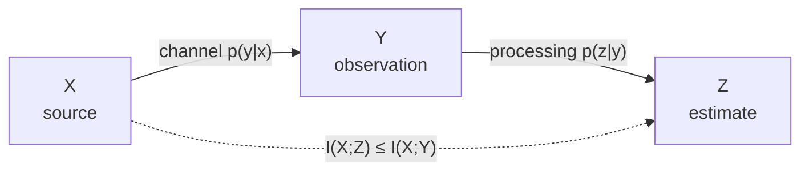

# Mutual Information and Relative Entropy

How much one variable says about another, how far one distribution sits from another, and the inequalities that tie the two together.

## Mutual Information

<!-- section: definition-mutual -->

:::definition[Mutual information]{#mutual-information}
For discrete random variables $X$ and $Y$ with joint pmf $p(x,y)$ and marginals $p(x)$, $p(y)$, the **mutual information** is

$$I(X;Y) = \sum_{x,y} p(x,y)\log_2\frac{p(x,y)}{p(x)p(y)}.$$
:::

:::proposition[Equivalent forms]{#mi-forms}
$$I(X;Y) = H(X) - H(X\mid Y) = H(Y) - H(Y\mid X) = H(X)+H(Y)-H(X,Y) = D\bigl(p(x,y)\,\|\,p(x)p(y)\bigr),$$

and $I(X;X) = H(X)$.
:::

:::proof
Split the logarithm in the definition: $\log_2\frac{p(x,y)}{p(x)p(y)} = \log_2\frac{p(x|y)}{p(x)} = -\log_2 p(x) + \log_2 p(x|y)$. Averaging the two terms against $p(x,y)$ gives $H(X)$ and $-H(X|Y)$ respectively, proving the first form; exchanging the roles of $x$ and $y$ gives the second. Substituting the chain rule $H(X|Y)=H(X,Y)-H(Y)$ into the first gives the third. The fourth is the definition of relative entropy applied to the pair of distributions $p(x,y)$ and $p(x)p(y)$ on $\mathcal X\times\mathcal Y$. Finally, $H(X|X)=0$, so $I(X;X)=H(X)-0=H(X)$.
:::

:::notation
The semicolon in $I(X;Y)$ separates the two *sides* of the information; the comma in $H(X,Y)$ joins variables into one. Thus $I(X;Y,Z)$ is the information that the pair $(Y,Z)$ carries about $X$, whereas $I(X,Y;Z)$ is the information that $Z$ carries about the pair. The two are different quantities.
:::

:::intuition
Take the total description cost of the pair. Describing $X$ and $Y$ separately costs $H(X)+H(Y)$; describing them jointly costs $H(X,Y)$. The saving is the redundancy between them — information that appears twice in the separate description and once in the joint one. That saving is $I(X;Y)$.

Because entropy is self-information, $I(X;X) = H(X)$: everything a variable knows about itself is everything it is.
:::

The three entropies and the mutual information partition the joint entropy into three non-overlapping pieces, a decomposition worth keeping at hand.

| Quantity | In terms of the pieces | Meaning |
|---|---|---|
| $H(X\mid Y)$ | left piece | in $X$ only |
| $I(X;Y)$ | middle piece | shared |
| $H(Y\mid X)$ | right piece | in $Y$ only |
| $H(X)$ | left $+$ middle | all of $X$ |
| $H(Y)$ | middle $+$ right | all of $Y$ |
| $H(X,Y)$ | all three | the pair |

:::example[Two correlated bits]
Let $p(0,0)=p(1,1)=0.4$ and $p(0,1)=p(1,0)=0.1$. Compute $I(X;Y)$ two ways.
:::

:::solution
Both marginals are fair bits, so $H(X)=H(Y)=1$. From the earlier calculation, $H(X,Y) \approx 1.722$ bits, so

$$I(X;Y) = 1 + 1 - 1.722 = 0.278 \text{ bits}.$$

By the divergence form, the product of marginals puts $0.25$ in each cell, so

$$I(X;Y) = 2(0.4)\log_2\frac{0.4}{0.25} + 2(0.1)\log_2\frac{0.1}{0.25} = 0.8(0.6781)+0.2(-1.3219) \approx 0.542 - 0.264 = 0.278.$$

The two routes agree. Sanity check: $0 < 0.278 < \min(H(X),H(Y)) = 1$, as required for variables that are dependent but not deterministic functions of each other. □
:::

## Interpretation, and Information in the Presence of a Third Variable

<!-- section: interpretation -->

In a communication setting $X$ is what was sent and $Y$ is what was received; $I(X;Y)$ is the number of bits per use that actually got through. The two extremes read off immediately from Proposition *Equivalent forms*: $I(X;Y)=0$ when $Y$ is independent of $X$ (nothing got through), and $I(X;Y)=H(X)$ when $H(X|Y)=0$, i.e. $X$ is recoverable from $Y$ (everything got through).

:::example[Reading a channel's throughput]
A source $X$ is uniform on $8$ symbols and the receiver's residual uncertainty is $H(X|Y)=0.8$ bits. How much information crosses per use, and what does Fano say about the decoder?
:::

:::solution
$H(X)=\log_2 8 = 3$, so $I(X;Y)=3-0.8=2.2$ bits per use. Fano's inequality with $|\mathcal X|=8$ gives

$$P_e \ge \frac{H(X|Y)-1}{\log_2 8} = \frac{0.8-1}{3} < 0,$$

a vacuous bound — which is the right answer, since $0.8$ bits of residual uncertainty is consistent with a very good decoder. The sharp form $0.8 \le h(P_e)+P_e\log_2 7$ gives $P_e \gtrsim 0.15$, a real constraint. □
:::

Once a third variable is in play, the natural object is mutual information computed inside each slice of that variable.

:::definition[Conditional mutual information]{#conditional-mutual-information}
$$I(X;Y\mid Z) = H(X\mid Z) - H(X\mid Y,Z) = \sum_{x,y,z} p(x,y,z)\log_2\frac{p(x,y\mid z)}{p(x\mid z)\,p(y\mid z)}.$$
:::

By the conditioning principle, $I(X;Y|Z)\ge 0$, with equality exactly when $X$ and $Y$ are conditionally independent given $Z$.

:::theorem[Chain rule for mutual information]{#mi-chain-rule}
$$I(X_1,\dots,X_n;\,Y) = \sum_{i=1}^n I\bigl(X_i;\,Y \mid X_1,\dots,X_{i-1}\bigr).$$
:::

:::proof
Write the left side as a difference of entropies and expand each by the chain rule:

$$I(X_{1:n};Y) = H(X_{1:n}) - H(X_{1:n}\mid Y) = \sum_{i=1}^n H(X_i\mid X_{<i}) - \sum_{i=1}^n H(X_i \mid X_{<i}, Y).$$

Pairing the sums term by term, the $i$-th difference is $H(X_i\mid X_{<i}) - H(X_i\mid X_{<i},Y) = I(X_i;Y\mid X_{<i})$ by the definition of conditional mutual information.
:::

:::pitfall
Conditioning can *increase* mutual information. Let $X$ and $Y$ be independent fair bits and let $Z = X \oplus Y$. Then $I(X;Y)=0$, but given $Z$ the two bits determine each other, so $I(X;Y\mid Z) = 1$ bit. Conversely, conditioning on a common cause destroys mutual information. There is therefore **no** general inequality between $I(X;Y)$ and $I(X;Y\mid Z)$ — unlike entropy, where conditioning always reduces.
:::

:::intuition
The exclusive-or example is the canonical warning. Two unrelated facts can become perfectly correlated once you learn a constraint that couples them — knowing the parity of two unknown bits turns each into the other's answer key. The "Venn diagram" picture of information, which suggests $I(X;Y|Z) \le I(X;Y)$, is unreliable precisely here: the three-variable analogue $I(X;Y)-I(X;Y|Z)$ can be negative.
:::

## Non-negativity, Data Processing, and Convexity

<!-- section: properties-special -->

:::theorem[Information inequality]{#information-inequality}
$I(X;Y) \ge 0$, with equality if and only if $X$ and $Y$ are independent.
:::

:::proof
By Proposition *Equivalent forms*, $I(X;Y) = D\bigl(p(x,y)\|p(x)p(y)\bigr)$, and Gibbs' inequality gives $D \ge 0$ with equality iff the two distributions coincide — that is, iff $p(x,y)=p(x)p(y)$ for all $x,y$.
:::

This single inequality is what turns the identities of the chapter into bounds: subadditivity, conditioning reduces entropy, and the independence bound are all restatements of $I \ge 0$.

:::proposition[Elementary properties]{#mi-properties}
Mutual information is symmetric, $I(X;Y)=I(Y;X)$; satisfies $I(X;Y)\le \min\bigl(H(X),H(Y)\bigr)$; equals $H(X)$ when $Y$ determines $X$; and is unchanged by relabelling, $I(f(X);g(Y)) = I(X;Y)$ whenever $f$ and $g$ are injective on the respective supports.
:::

:::proof
Symmetry is visible in the definition, which is symmetric in $x$ and $y$. The bound follows from $I(X;Y)=H(X)-H(X|Y) \le H(X)$ since $H(X|Y)\ge 0$, and symmetrically for $H(Y)$. If $H(X|Y)=0$ then $I(X;Y)=H(X)$. Invariance under injections holds because an injective relabelling leaves the joint pmf's list of values unchanged.
:::

The central structural theorem is that information cannot be created by processing. Recall that $X \to Y \to Z$ is a **Markov chain** when $Z$ is conditionally independent of $X$ given $Y$, i.e. $p(z\mid y,x) = p(z\mid y)$ — the situation whenever $Z$ is computed from $Y$ alone, possibly with independent randomness.

:::theorem[Data processing inequality]{#data-processing-inequality}
If $X \to Y \to Z$ is a Markov chain, then

$$I(X;Z) \le I(X;Y), \qquad I(X;Z)\le I(Y;Z).$$

Equality in the first holds if and only if $X\to Z\to Y$ is also a Markov chain.
:::

:::proof
Expand $I(X;Y,Z)$ by the chain rule for mutual information in both orders:

$$I(X;Y,Z) = I(X;Z) + I(X;Y\mid Z) = I(X;Y) + I(X;Z\mid Y).$$

The Markov property says $X$ and $Z$ are conditionally independent given $Y$, so $I(X;Z\mid Y)=0$. Therefore

$$I(X;Z) + I(X;Y\mid Z) = I(X;Y),$$

and since $I(X;Y\mid Z)\ge 0$ we get $I(X;Z)\le I(X;Y)$, with equality exactly when $I(X;Y|Z)=0$, i.e. when $X$ and $Y$ are conditionally independent given $Z$. The second inequality follows by applying the first to the reversed chain $Z\to Y\to X$, which is also Markov.
:::

:::corollary[Processing your own data does not help]{#dpi-corollaries}
For any function $g$, $I\bigl(X; g(Y)\bigr)\le I(X;Y)$. Also, conditioning on a downstream variable cannot help: if $X\to Y\to Z$, then $I(X;Y\mid Z)\le I(X;Y)$.
:::

:::proof
For the first, $X\to Y\to g(Y)$ is a Markov chain, so the data processing inequality applies. For the second, the displayed identity in the proof above rearranges to $I(X;Y\mid Z) = I(X;Y) - I(X;Z) \le I(X;Y)$, since $I(X;Z)\ge0$.
:::

:::intuition
No amount of cleverness applied to a received signal recovers information the channel destroyed. A denoiser, a decoder, a neural network — all are functions of $Y$, and all sit downstream of the bottleneck. This is why the data processing inequality is the backbone of converse proofs: it lets you replace the whole receiver by the single number $I(X;Y)$.
:::

:::example[Two noisy hops]
A fair bit $X$ passes through a binary symmetric channel with crossover $0.1$ to give $Y$, then through a second independent such channel to give $Z$. Verify the data processing inequality numerically.
:::

:::solution
For a fair input into a binary symmetric channel with crossover $p$, the output is also a fair bit, so $I(X;Y)=H(Y)-H(Y|X) = 1 - h(p)$. With $p=0.1$, $h(0.1)\approx 0.469$, so $I(X;Y)\approx 0.531$ bits.

The two hops compose into one channel that flips the bit exactly when precisely one of the two hops flips it, so the effective crossover is $p' = 0.1(0.9)+0.9(0.1)=0.18$. Hence $I(X;Z) = 1-h(0.18) \approx 1-0.680 = 0.320$ bits.

Check: $0.320 \le 0.531$. ✓ The inequality is strict, as it must be whenever the second hop is genuinely noisy. □
:::

Finally, mutual information has a convexity structure that underlies the computation of capacity and of rate–distortion functions.

:::theorem[Concavity and convexity of mutual information]{#mi-convexity}
Write $I(X;Y)$ as a function of the input distribution $p(x)$ and the channel $p(y|x)$. Then

1. for fixed $p(y|x)$, $I(X;Y)$ is a **concave** function of $p(x)$;
2. for fixed $p(x)$, $I(X;Y)$ is a **convex** function of $p(y|x)$.
:::

:::proof
(1) Write $I(X;Y) = H(Y) - H(Y|X)$. With the channel fixed, $H(Y|X) = \sum_x p(x)H(Y|X=x)$ is *linear* in $p(x)$. The output distribution $p(y) = \sum_x p(x)p(y|x)$ is also linear in $p(x)$, and $H$ is concave in a distribution (Theorem *Concavity of entropy*), so $H(Y)$ is a concave function of $p(x)$. A concave function minus a linear one is concave.

(2) Here we use the divergence form. Fix $p(x)$ and let $p_1(y|x), p_2(y|x)$ be two channels with output distributions $q_1, q_2$; for $\lambda\in[0,1]$ the mixed channel $p_\lambda = \lambda p_1 + (1-\lambda)p_2$ has output $q_\lambda = \lambda q_1+(1-\lambda)q_2$. Then $I = D\bigl(p(x)p(y|x)\,\|\,p(x)q(y)\bigr)$, and relative entropy is jointly convex in its pair of arguments (Theorem *Convexity of relative entropy*). Since both arguments are affine in the channel, the composition is convex.
:::

:::note
Claim (1) is why capacity $C=\max_{p(x)}I(X;Y)$ is a well-behaved optimisation: a concave function on the simplex has a unique maximum value, attainable by convex programming (the Blahut–Arimoto algorithm). Claim (2) says that mixing two channels is at least as bad as the mix of their informations — noise does not average favourably.
:::

## Relative Entropy

<!-- section: definition-kl -->

:::definition[Relative entropy (Kullback–Leibler divergence)]{#kl-divergence}
For probability mass functions $p$ and $q$ on a common alphabet $\mathcal X$,

$$D(p\,\|\,q) = \sum_{x} p(x)\log_2\frac{p(x)}{q(x)} = \mathbb{E}_{X\sim p}\Bigl[\log_2\frac{p(X)}{q(X)}\Bigr],$$

with the conventions $0\log\tfrac{0}{q} = 0$ and $p\log\tfrac{p}{0} = \infty$ for $p>0$. Thus $D(p\|q) = \infty$ unless $p$ is absolutely continuous with respect to $q$, i.e. $q(x)=0 \Rightarrow p(x)=0$.
:::

:::intuition
You built a compressor believing the world follows $q$. It actually follows $p$. Then $D(p\|q)$ is the number of extra bits per symbol you spend — the fine for a wrong model, payable on every symbol forever. If your model assigns probability zero to something that actually happens, the fine is infinite, which is the information-theoretic statement of "never say never".
:::

:::pitfall
$D$ is not symmetric and the asymmetry is not a technicality; it changes what the divergence rewards. $D(p\|q)$ averages under $p$, so it punishes a model $q$ that is too *narrow* (it must cover everything $p$ does). $D(q\|p)$ averages under $q$ and punishes a model that is too *broad*. In variational inference the choice between "forward" and "reverse" KL is exactly the choice between a mode-covering and a mode-seeking approximation.
:::

:::example[A mismatched coin model]
The true source is Bernoulli$(0.9)$; the model is a fair coin. Compute $D(p\|q)$ and $D(q\|p)$.
:::

:::solution
Forward:

$$D(p\|q) = 0.9\log_2\frac{0.9}{0.5} + 0.1\log_2\frac{0.1}{0.5} = 0.9(0.8480) + 0.1(-2.3219) \approx 0.763 - 0.232 = 0.531 \text{ bits}.$$

Reverse:

$$D(q\|p) = 0.5\log_2\frac{0.5}{0.9} + 0.5\log_2\frac{0.5}{0.1} = 0.5(-0.8480)+0.5(2.3219) \approx -0.424 + 1.161 = 0.737 \text{ bits}.$$

The two differ, confirming asymmetry, and both are positive as Gibbs' inequality requires. Note also that there is a clean shortcut for the forward direction: $D(p\|q) = H(p,q)-H(p) = 1 - 0.469 = 0.531$, since coding every outcome at $-\log_2 0.5 = 1$ bit gives cross-entropy exactly $1$. □
:::

## Cross-Entropy and Excess Code Length

<!-- section: interpretation-kl -->

:::definition[Cross-entropy]{#cross-entropy}
The **cross-entropy** of $p$ relative to $q$ is

$$H(p,q) = -\sum_x p(x)\log_2 q(x),$$

the expected code length when the code lengths are the ideal lengths $-\log_2 q(x)$ for the model $q$ but the data are drawn from $p$.
:::

:::notation
The symbol $H(p,q)$ for cross-entropy collides with $H(X,Y)$ for joint entropy. The arguments disambiguate: two *distributions* means cross-entropy, two *random variables* means joint entropy. Some authors write $H_q(p)$ or $\mathrm{CE}(p,q)$ to avoid the clash.
:::

:::theorem[Relative entropy is excess code length]{#kl-excess-length}
$$H(p,q) = H(p) + D(p\,\|\,q), \qquad\text{equivalently}\qquad D(p\,\|\,q) = H(p,q) - H(p).$$
:::

:::proof
Insert $\log_2 p(x)$ twice:

$$H(p,q) = -\sum_x p(x)\log_2 q(x) = -\sum_x p(x)\log_2 p(x) + \sum_x p(x)\log_2\frac{p(x)}{q(x)} = H(p) + D(p\|q).$$
:::

Combined with the source coding theorem this is a complete operational reading of $D$. Coding $p$-distributed data with a code matched to $q$ costs $H(p,q)$ bits per symbol; the best possible is $H(p)$; the gap is $D(p\|q)$, and Gibbs' inequality says the gap is never negative. This is also exactly the statement that maximum-likelihood fitting is divergence minimisation: since $H(p)$ does not depend on the model, minimising cross-entropy over $q$ minimises $D(p\|q)$.

:::intuition
Cross-entropy is what you actually pay; entropy is what you would pay with a perfect model; divergence is the surcharge. Training a classifier by minimising cross-entropy is, in these terms, buying down the surcharge on a code for the labels.
:::

:::example[Reading the decomposition]
The biased coin of the last example has $H(p) = 0.469$ bits. Confirm the excess-length identity against the fair-coin code.
:::

:::solution
Under the fair-coin model every outcome gets a $1$-bit codeword, so $H(p,q) = 0.9(1)+0.1(1) = 1$ bit exactly. Then

$$D(p\|q) = H(p,q)-H(p) = 1 - 0.469 = 0.531 \text{ bits},$$

matching the direct computation. Interpretation: coding a million biased flips with a fair-coin code costs $1{,}000{,}000$ bits where $469{,}000$ would have sufficed — $531{,}000$ wasted bits, every one of them attributable to the model error. □
:::

## Gibbs, Log-Sum, Convexity, and Mutual Information

<!-- section: properties-uses -->

:::theorem[Gibbs' inequality / information inequality]{#gibbs-inequality}
For any distributions $p$, $q$ on a common alphabet,

$$D(p\,\|\,q) \ge 0,$$

with equality if and only if $p(x)=q(x)$ for every $x$.
:::

:::proof
*Via Jensen.* Let $S = \{x : p(x)>0\}$. Since $\log_2$ is concave,

$$-D(p\|q) = \sum_{x\in S} p(x)\log_2\frac{q(x)}{p(x)} \le \log_2\sum_{x\in S}p(x)\frac{q(x)}{p(x)} = \log_2\sum_{x\in S}q(x) \le \log_2 1 = 0.$$

Strict concavity makes the first step an equality only when $q(x)/p(x)$ is constant on $S$, and the second only when $q$ places no mass outside $S$; the two together force $q=p$.

*Via log-sum.* Apply the log-sum inequality with $a_i = p(x_i)$ and $b_i = q(x_i)$: the left side is $D(p\|q)$ and the right side is $1\cdot\log_2(1/1) = 0$. The equality condition — constant ratio $p(x)/q(x)$ — again gives $p=q$, since both sum to $1$.
:::

:::corollary[Uniform maximises entropy]{#uniform-max}
For $X$ on a finite alphabet $\mathcal X$ and $u$ the uniform distribution,

$$D(p\,\|\,u) = \log_2|\mathcal X| - H(X) \ \ge 0.$$
:::

:::proof
$D(p\|u) = \sum_x p(x)\log_2\bigl(p(x)|\mathcal X|\bigr) = \log_2|\mathcal X| + \sum_x p(x)\log_2 p(x) = \log_2|\mathcal X| - H(X)$, and Gibbs' inequality gives the bound.
:::

This is a second, cleaner proof of the upper bound in Theorem *Range of entropy*, and it exhibits the "distance from uniform" as exactly the entropy deficit — a quantity engineers call the *redundancy* of the source.

:::theorem[Convexity of relative entropy]{#kl-convexity}
$D(p\,\|\,q)$ is jointly convex in the pair $(p,q)$: for $\lambda \in [0,1]$,

$$D\bigl(\lambda p_1 + (1-\lambda)p_2 \,\big\|\, \lambda q_1 + (1-\lambda)q_2\bigr) \ \le\ \lambda D(p_1\|q_1) + (1-\lambda)D(p_2\|q_2).$$
:::

:::proof
Fix $x$ and apply the log-sum inequality to the two-term lists $a = (\lambda p_1(x), (1-\lambda)p_2(x))$ and $b = (\lambda q_1(x), (1-\lambda)q_2(x))$:

$$\bigl(\lambda p_1(x)+(1-\lambda)p_2(x)\bigr)\log_2\frac{\lambda p_1(x)+(1-\lambda)p_2(x)}{\lambda q_1(x)+(1-\lambda)q_2(x)} \le \lambda p_1(x)\log_2\frac{p_1(x)}{q_1(x)} + (1-\lambda)p_2(x)\log_2\frac{p_2(x)}{q_2(x)},$$

where the constants $\lambda$ cancel inside each logarithm on the right. Summing over $x$ gives the claim.
:::

:::proposition[Mutual information as a divergence]{#mi-as-kl}
$$I(X;Y) = D\bigl(p(x,y)\,\big\|\,p(x)p(y)\bigr),$$

so mutual information measures exactly how far the joint distribution sits from independence.
:::

:::proof
Immediate from the definitions: the summand $p(x,y)\log_2\frac{p(x,y)}{p(x)p(y)}$ is the divergence summand with the pair $(x,y)$ as the alphabet symbol.
:::

:::example[Mutual information computed as a divergence]
Take $p(0,0)=p(1,1)=0.4$, $p(0,1)=p(1,0)=0.1$ again, and verify Proposition *Mutual information as a divergence* against the entropy route.
:::

:::solution
The marginals are fair bits, so $p(x)p(y) = 0.25$ in every cell. Then

$$D = 2(0.4)\log_2\frac{0.4}{0.25} + 2(0.1)\log_2\frac{0.1}{0.25} = 0.8(0.6781) + 0.2(-1.3219) \approx 0.5425 - 0.2644 = 0.278 \text{ bits}.$$

Via entropies: $H(X)=H(Y)=1$ and $H(X,Y)\approx 1.722$, so $I = 2-1.722 = 0.278$ bits. ✓ Both routes agree, and when $X$ and $Y$ are independent the joint *is* the product, making both zero. □
:::

Relative entropy also conditions and chains, exactly as entropy does.

:::definition[Conditional relative entropy]{#conditional-kl}
For joint distributions $p(x,y)$ and $q(x,y)$,

$$D\bigl(p(y|x)\,\|\,q(y|x)\bigr) = \sum_x p(x)\sum_y p(y|x)\log_2\frac{p(y|x)}{q(y|x)}.$$
:::

:::theorem[Chain rule for relative entropy]{#kl-chain-rule}
$$D\bigl(p(x,y)\,\|\,q(x,y)\bigr) = D\bigl(p(x)\,\|\,q(x)\bigr) + D\bigl(p(y|x)\,\|\,q(y|x)\bigr).$$
:::

:::proof
Factor both joints and split the logarithm:

$$\sum_{x,y}p(x,y)\log_2\frac{p(x)p(y|x)}{q(x)q(y|x)} = \sum_{x,y}p(x,y)\log_2\frac{p(x)}{q(x)} + \sum_{x,y}p(x,y)\log_2\frac{p(y|x)}{q(y|x)},$$

and the first sum collapses to $D(p(x)\|q(x))$ because $\sum_y p(x,y)=p(x)$.
:::

:::corollary[Data processing for divergence]{#kl-dpi}
If $p$ and $q$ are pushed through the same channel $r(y|x)$, producing $\tilde p(y) = \sum_x p(x)r(y|x)$ and $\tilde q$ likewise, then $D(\tilde p\,\|\,\tilde q) \le D(p\,\|\,q)$.
:::

:::proof
Apply the chain rule in the two orders to the joints $p(x)r(y|x)$ and $q(x)r(y|x)$. Expanding on $x$ first gives $D(p\|q) + D(r\|r) = D(p\|q)$, since the conditional term vanishes. Expanding on $y$ first gives $D(\tilde p\|\tilde q) + D\bigl(p(x|y)\|q(x|y)\bigr) \ge D(\tilde p\|\tilde q)$. Comparing the two expansions gives the result.
:::

:::theorem[Pinsker's inequality (quoted)]{#pinsker}
With total variation distance $\|p-q\|_{TV} = \tfrac12\sum_x |p(x)-q(x)|$,

$$\|p-q\|_{TV} \le \sqrt{\tfrac{\ln 2}{2}\,D(p\,\|\,q)}\,,$$

where $D$ is in bits. In particular, small divergence forces small total variation distance.
:::

:::note
We do not prove Pinsker's inequality here. The standard argument reduces to the binary case by the data processing inequality for divergence (Corollary *Data processing for divergence*, with the channel that reports whether $x$ lies in the set where $p>q$), and then verifies the two-point inequality $\,2(p-q)^2/\ln 2 \le d(p\|q)$ by calculus. The reduction is within reach; the calculus step is a short but unilluminating computation.
:::

:::intuition
Pinsker is the reason divergence deserves the name "divergence": it dominates a genuine metric, so $D(p_n\|q)\to 0$ implies $p_n \to q$ in the ordinary sense. The converse fails badly — two distributions can be within $10^{-9}$ in total variation and have infinite divergence, if one of them assigns probability zero where the other does not.
:::

## Common Mistakes

- **Confusing information with meaning or importance.** Entropy measures statistical unpredictability. A random digit string can have maximal entropy and no significance whatsoever.
- **Reading a surprisal as an entropy.** $-\log_2 p(x)$ is attached to one outcome; $H(X)$ is its average. The rare outcome of a near-deterministic source has enormous surprisal while the source itself has almost no entropy.
- **Forgetting to fix a base.** Mixing $\log_2$ and $\ln$ in one calculation produces answers off by the factor $\ln 2 \approx 0.693$. Fix the base at the start and state the unit with every number.
- **Treating entropy as a property of a particular string.** Entropy belongs to a distribution; the individual-string analogue is Kolmogorov complexity, a different and uncomputable quantity.
- **Expecting a symbol code to reach $H$ exactly.** The gap in $H \le L^{*} < H+1$ is real and closes only when the probabilities are dyadic, or in the limit of long blocks.
- **Quoting capacity as a property of the input.** $C = \max_{p(x)} I(X;Y)$ maximises over inputs; it is a property of the *channel*.

Entropy is the central quantity of information theory: the average surprisal of a source, the number of bits per symbol that an ideal compressor needs, and — by the characterisation below — the only function of a distribution that behaves the way a measure of uncertainty ought to. The next three sections define it, establish its structural properties, and develop the habits needed to compute it.

- **Dropping the minus sign.** $\sum p\log p$ is negative; entropy is its negative. If your answer is negative, you dropped the sign.
- **Leaving $0\log 0$ undefined in code.** Mathematically it is $0$; in a program it is `NaN`. Guard the zero-probability terms explicitly.
- **Confusing the entropy of $p$ with a statistic of a sample.** $H$ is a functional of the distribution. What you compute from a finite sample is an *estimate*, and the plug-in estimate is biased downwards.
- **Assuming the maximum entropy on an alphabet is always attained.** It is — at the uniform distribution — but only when the whole alphabet is in the support. A distribution supported on $3$ of $8$ symbols is capped at $\log_2 3$, not $3$.
- **Thinking entropy measures spread in the numerical sense.** Relabelling the outcomes changes the variance and leaves the entropy untouched.
- **Using the single-symbol entropy for a source with memory.** That is an upper bound on the true per-symbol cost; the entropy rate of the final sections is the correct quantity.

A source rarely emits one symbol in isolation. Joint entropy extends $H$ to a vector of random variables and is the quantity that the rest of the chapter is built on: conditional entropy, mutual information, and entropy rate are all differences of joint entropies.

- **Writing $H(X,Y) = H(X)+H(Y)$ unconditionally.** That is the independence case only; in general the sum is an upper bound.
- **Confusing joint entropy with mutual information.** $H(X,Y)$ is the total; $I(X;Y) = H(X)+H(Y)-H(X,Y)$ is the overlap.
- **Assuming the joint support is the full product $\mathcal{X}\times\mathcal{Y}$.** Dependence empties cells, and $H(X,Y) \le \log_2(\text{number of occupied cells})$ can be far below $\log_2(|\mathcal{X}||\mathcal{Y}|)$.
- **Reversing the chain rule.** It is $H(X,Y) = H(X) + H(Y|X)$, never $H(X) + H(X|Y)$. Check that the conditioning variable is the one already "paid for".
- **Expanding in an order that makes life hard.** The chain rule holds in every order; choose the one whose conditionals you actually know.
- **Forgetting that the chain rule conditions gracefully.** Every identity here remains true with an extra $\mid Z$ attached to every term.

Conditional entropy measures how much uncertainty about $Y$ survives once $X$ has been observed. It is the information-theoretic counterpart of residual variance in regression, and it is the quantity that turns entropy from a static measure of a source into a measure of *prediction difficulty*.

- **Believing $H(Y|X)$ can be negative.** It is an average of entropies and so is always $\ge 0$. (Its continuous analogue, conditional *differential* entropy, genuinely can be negative — see the final section.)
- **Confusing $H(Y|X)$ with $I(X;Y)$.** The first is what is left; the second is what was removed. They sum to $H(Y)$.
- **Computing $H(Y|X)$ from marginals.** You need $p(y|x)$ or the joint. No function of $p(x)$ and $p(y)$ alone determines $H(Y|X)$.
- **Generalising from a single $x$.** $H(Y|X=x)$ may exceed $H(Y)$; only the average cannot.
- **Reading $H(Y|X)=0$ as "every $x$ determines $y$".** It means that for $p$-almost every $x$ the conditional law is a point mass; values of probability zero are unconstrained.
- **Applying Fano without checking the alphabet.** The bound involves $\log_2(|\mathcal Y|-1)$; for a binary $Y$ that term vanishes and Fano reduces to $H(Y|X)\le h(P_e)$, which is much sharper than the generic form.

Mutual information is the quantity that makes information theory a theory of *communication* rather than of storage alone. It measures how much observing one variable tells you about another, it is symmetric, and it is the maximand in the definition of channel capacity.

- **Thinking mutual information can be negative.** $I(X;Y)\ge 0$ always. The three-way quantity $I(X;Y)-I(X;Y|Z)$ (the "interaction information") *can* be negative, which is why the Venn picture must be used with care.
- **Expecting $I(X;Y\mid Z)\le I(X;Y)$.** False in general; the exclusive-or example above is the standard counterexample.
- **Confusing $I(X;Y,Z)$ with $I(X,Y;Z)$.** The semicolon marks the split. Read it before computing.
- **Reading $I(X;Y)=0$ as "no relationship of any kind".** It means exactly statistical independence — which is strong, not weak. There is no residual "higher-order dependence" hiding behind $I=0$ for a pair.
- **Inferring causation from mutual information.** $I$ is symmetric; it cannot distinguish $X$ causing $Y$ from $Y$ causing $X$ from a common cause.
- **Believing a better decoder can beat the data processing inequality.** Every decoder is a function of the received signal and is therefore bound by it.

Relative entropy, or Kullback–Leibler divergence, measures how far one distribution is from another. It is not a metric — it is asymmetric and violates the triangle inequality — but it is the correct notion of discrepancy for every question in this subject, because it is exactly the number of bits wasted by using the wrong model.

- **Treating $D$ as a distance.** It is asymmetric and fails the triangle inequality. Use it because of its coding meaning, not because it looks like a metric.
- **Ignoring support mismatch.** If $q(x)=0$ while $p(x)>0$ then $D(p\|q)=\infty$. In practice this is what makes unsmoothed maximum-likelihood language models blow up on unseen words.
- **Confusing $D(p\|q)$ with $H(p)-H(q)$.** The difference of entropies can have either sign and is unrelated; $D$ involves the cross term $H(p,q)$.
- **Forgetting which distribution supplies the weights.** The expectation in $D(p\|q)$ is under $p$. That is the entire source of the asymmetry.
- **Minimising the wrong direction.** Maximum likelihood minimises $D(\hat p_{\text{data}}\|q)$; variational inference typically minimises $D(q\|p)$. They have different optima and different failure modes.
- **Reading small $D$ as "the distributions agree everywhere".** $D$ is an average; a rare event can be badly mismodelled with little effect on $D$ and a large effect on a tail estimate.

For a single random variable, entropy is the uncertainty per draw. For a *process* $X_1, X_2, X_3,\dots$ the symbols are usually dependent, and the right quantity is the entropy **rate**: the average information per symbol in the long run. This is the number that governs the compressibility of real files, whose symbols are anything but independent.

- **Using the single-symbol entropy for a source with memory.** It overestimates the true cost; the entropy rate is the correct number and is strictly smaller unless the source is i.i.d.
- **Assuming the rate always exists.** Stationarity is what guarantees it. A non-stationary process can have $\tfrac1nH(X_{1:n})$ oscillating forever.
- **Confusing the entropy rate with the entropy of the stationary distribution.** $H(\mu)$ ignores the transitions and is only an upper bound.
- **Believing $H(X_n\mid X_{1:n-1})$ can increase.** For a stationary process it is non-increasing in $n$ — that is Lemma *The conditional entropies decrease*, and it is what makes the limit exist. (Both $H(X_n|X_{1:n-1})$ and $\tfrac1nH(X_{1:n})$ are non-increasing, and the first is below the second.)
- **Reading the AEP as "all long sequences are equally likely".** It says the *log-probabilities per symbol* concentrate. Two typical sequences can still differ in probability by a factor of $2^{n\varepsilon}$.
- **Carrying discrete intuitions into differential entropy.** $h$ can be negative, changes under scaling, and is not a description length.
